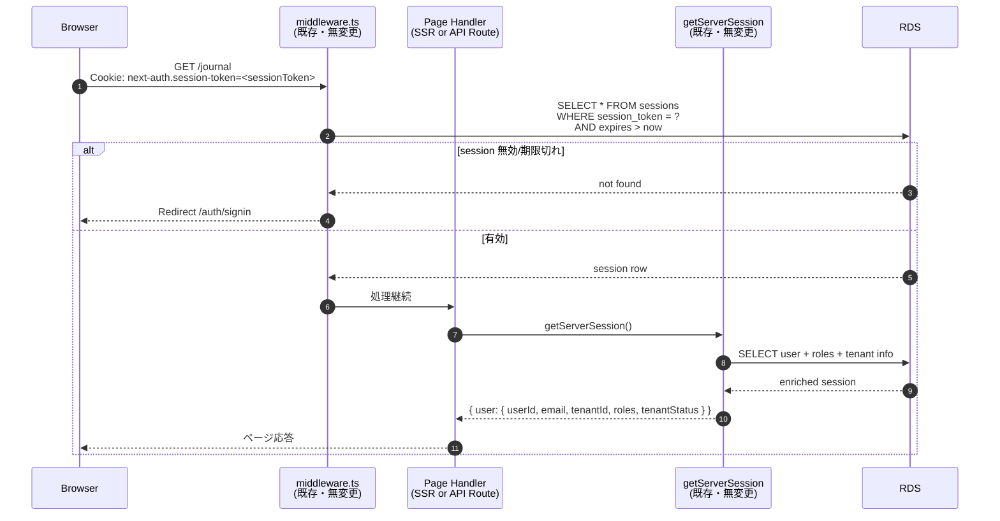
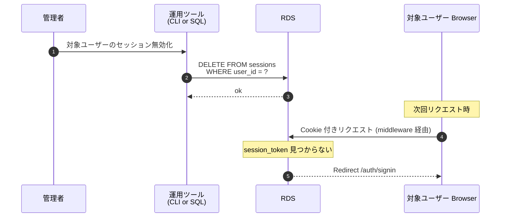

# 認証外部化設計 (Google ID Token + 自前セッション)

**作成日**: 2026-04-19
**背景**: App Runner の終了通知 + Google OAuth のバックエンド外向き通信（NAT 要求）を根本的に解消するため、認証フローを「認証は外・セッションは中」パターンに変更。
**関連ドキュメント**:
- `aidlc-docs/construction/deployment-phases.md` — Phase 1 As-Built
- `aidlc-docs/construction/migration-apprunner-to-ecs-express.md` — ECS 移行計画（この設計採用により緊急性が下がる）

---

## 設計の骨子

**OpenID Connect Relying Party (RP) パターン**に沿った実装。

- **認証（Authentication）**: ブラウザが Google と直接通信して ID Token を取得
- **検証（Token Verification）**: バックエンドが Docker image に焼き込まれた JWKS でローカル検証
- **セッション（Session Management）**: 既存の sessions テーブル + next-auth.session-token Cookie を継続利用（SP-07 論点 C の database 戦略を維持）

バックエンドから Google への通信はゼロ。

---

## コンポーネント構成

```
┌──────────────────────────────────────────────────────────────────────┐
│ Browser                                                              │
│                                                                      │
│   ┌──────────────────────────────────────────────────┐              │
│   │ @react-oauth/google SDK                          │              │
│   │   useGoogleLogin({ flow: 'implicit' })           │              │
│   └──────────────────────────────────────────────────┘              │
│   ↕                                                                  │
│   Google OAuth Flow (Browser ⇔ Google 直接)                         │
│   ↕                                                                  │
│   POST /api/auth/google-signin { idToken }                           │
└──────────────────────────────────────┬───────────────────────────────┘
                                       │
                                       ▼
┌──────────────────────────────────────────────────────────────────────┐
│ Next.js Backend (App Runner / ECS)                                   │
│                                                                      │
│   ┌────────────────────────────────────────────────────────────┐    │
│   │ /api/auth/google-signin.ts (new)                           │    │
│   │   1. verifyGoogleIdToken(idToken)                          │    │
│   │      ├─ local JWKS (bundled at Docker build)               │    │
│   │      └─ jose.jwtVerify 署名・iss・aud・exp 検証            │    │
│   │   2. users テーブルで email 検索 (BR-AUTH-01 招待済み確認) │    │
│   │   3. sessions テーブルに INSERT (UUID sessionToken)        │    │
│   │   4. Set-Cookie: next-auth.session-token=<token>           │    │
│   └────────────────────────────────────────────────────────────┘    │
│                                                                      │
│   ┌────────────────────────────────────────────────────────────┐    │
│   │ middleware.ts (既存・無変更)                                │    │
│   │   next-auth.session-token cookie 読込 → 有効性判定          │    │
│   └────────────────────────────────────────────────────────────┘    │
│                                                                      │
│   ┌────────────────────────────────────────────────────────────┐    │
│   │ auth-options.ts (providers を [] に・DrizzleAdapter 維持) │    │
│   │   session: { strategy: 'database' } 維持                   │    │
│   │   session() callback: tenantId / roles 解決 (既存ロジック)  │    │
│   └────────────────────────────────────────────────────────────┘    │
│                                                                      │
│   ┌────────────────────────────────────────────────────────────┐    │
│   │ getServerSession / withAuthSSR / withAuthApi (既存・無変更)│    │
│   │   sessions テーブルを読んで認証コンテキストを提供           │    │
│   └────────────────────────────────────────────────────────────┘    │
└──────────────────────────────────────┬───────────────────────────────┘
                                       │
                                       ▼
                                ┌──────────────┐
                                │ RDS          │
                                │ sessions     │
                                │ users        │
                                └──────────────┘

外部通信: Browser ⇔ Google のみ（バックエンドは一切 Google と通信しない）
```

---

## シーケンス 1: ログイン

```mermaid
sequenceDiagram
    autonumber
    participant U as Browser
    participant F as Next.js Frontend<br/>(/auth/signin)
    participant G as Google<br/>(accounts.google.com)
    participant B as Next.js Backend<br/>(/api/auth/google-signin)
    participant DB as RDS

    U->>F: /auth/signin にアクセス
    F-->>U: 「Google でログイン」ボタン表示<br/>(@react-oauth/google SDK 初期化)

    U->>F: ボタンクリック
    F->>G: OAuth Authorization Request<br/>(client_id, response_type=id_token, scope=openid email profile, nonce)
    Note over F,G: ポップアップ or リダイレクトで Google の認可画面を表示
    G-->>U: Google ログイン・同意画面
    U->>G: 認証・同意操作
    G-->>F: ID Token (JWT) を返す<br/>(Browser JavaScript で受信)

    F->>B: POST /api/auth/google-signin<br/>Body: { idToken }
    B->>B: バンドル済み JWKS 読込 (google-jwks.json)
    B->>B: jose.jwtVerify で署名検証<br/>- iss: accounts.google.com<br/>- aud: GOOGLE_CLIENT_ID<br/>- exp: 未失効<br/>- nonce: 検証 (リプレイ対策)
    alt 検証失敗
        B-->>F: 401 Unauthorized
        F-->>U: エラー表示
    else 検証成功
        B->>DB: SELECT * FROM users<br/>WHERE email = payload.email<br/>AND deleted_at IS NULL
        alt ユーザー未招待 (BR-AUTH-01)
            DB-->>B: row not found
            B-->>F: 403 Forbidden<br/>{ error: 'not_invited' }
            F-->>U: "アカウントが見つかりません..."
        else 招待済みユーザー
            DB-->>B: user (id, email, name)
            B->>B: sessionToken = uuidv4()
            B->>DB: INSERT INTO sessions<br/>(session_token, user_id, expires)<br/>VALUES (sessionToken, user.id, now+8h)
            DB-->>B: ok
            B-->>F: 200 OK<br/>Set-Cookie: next-auth.session-token=<sessionToken>;<br/>HttpOnly; Secure; SameSite=Lax; Max-Age=28800
        end
    end

    F->>U: Redirect to /
```

### ポイント

- **③〜⑤**: Browser と Google の直接通信（バックエンドは関与しない）
- **⑦**: バンドル済み JWKS でローカル検証（外部通信なし）
- **⑪**: BR-AUTH-01（招待なし登録禁止）を維持
- **⑬〜⑭**: 既存 sessions テーブルに NextAuth と同じ形式で書き込み・Cookie も同名

---

## シーケンス 2: 認証済みリクエスト（全ページ共通）



### ポイント

- **ミドルウェア・getServerSession の内部ロジックは一切変更しない**
- 既存の 14 箇所の `getServerSession()` 呼び出しは全て動作継続

---

## シーケンス 3: ログアウト

```mermaid
sequenceDiagram
    autonumber
    participant U as Browser
    participant F as Frontend<br/>(signOut ボタン)
    participant NA as NextAuth<br/>/api/auth/signout
    participant DB as RDS

    U->>F: 「ログアウト」クリック
    F->>NA: POST /api/auth/signout<br/>(NextAuth 標準ハンドラー)
    NA->>DB: DELETE FROM sessions<br/>WHERE session_token = ?
    DB-->>NA: ok
    NA-->>F: Set-Cookie: next-auth.session-token=;<br/>Max-Age=0<br/>Redirect to /auth/signin
    F-->>U: /auth/signin に遷移
```

### ポイント

- **NextAuth の標準 signOut ハンドラをそのまま使う**（DrizzleAdapter を維持しているため自動で sessions 削除してくれる）
- フロントコードの `signOut()` 呼び出しも無変更

---

## シーケンス 4: セッション即時失効（運用操作）



### ポイント

- **SP-07 論点 C の即時失効要件を維持**
- sessions テーブルから該当 session_token または user_id で DELETE するだけで即無効化

---

## 変更影響まとめ

### 🆕 新規追加

| ファイル | 内容 |
|---|---|
| `src/features/auth/lib/verifyGoogleIdToken.ts` | jose で ID Token をローカル検証する関数 |
| `src/features/auth/lib/google-jwks.json` | Google JWKS（Docker build 時に fetch・git 管理外） |
| `pages/api/auth/google-signin.ts` | ID Token を受け取りセッションを作成する API エンドポイント |

### 📝 書き換え

| ファイル | 変更内容 |
|---|---|
| `src/features/auth/lib/auth-options.ts` | `providers: [GoogleProvider]` → `providers: []`<br/>signIn callback 削除（google-signin 側で BR-AUTH-01 対応）<br/>`session` callback は維持 |
| `pages/auth/signin.tsx` | `signIn('google')` → `@react-oauth/google` の `useGoogleLogin` |
| `Dockerfile` | builder stage で JWKS curl |
| `package.json` | `jose` `@react-oauth/google` 追加 |
| `infra/lib/app-stack.ts` | `NEXT_PUBLIC_GOOGLE_CLIENT_ID` env 変数追加（フロント埋め込み用） |

### ✅ 完全無変更

- `middleware.ts`
- `src/features/auth/lib/withAuthSSR.ts`
- `src/features/auth/lib/withAuthApi.ts`
- `pages/index.tsx`・各 `pages/api/*.ts`（14 箇所の getServerSession 呼び出し全て）
- `next-auth.d.ts`（Session 型定義）
- `src/db/schema.ts`（users / sessions テーブルスキーマ）
- `__tests__/e2e/helpers/auth.ts`（dev-login も sessions 直接作成なので無影響）

---

## トレードオフと注意事項

### JWKS ローテーション

Google は ID Token の署名鍵を不定期ローテート（数週間〜数ヶ月）。バンドル方式の制約：

| シナリオ | 影響 |
|---|---|
| 鍵ローテ後・未デプロイ | 新規ログイン試行が失敗（`ERR_JWKS_NO_MATCHING_KEY`） |
| 鍵ローテ後・既存ログイン済みユーザー | **影響なし**（セッションは自前管理・Google ID Token を再使用しないため） |

**対策**:
- 週 1 以上のデプロイ頻度を維持
- CI に Cron 実行の "JWKS 更新デプロイ" を追加（週次）
- 将来的に S3 + Lambda で runtime 取得方式に昇格可能

### NextAuth を残す理由

完全撤去も検討したが以下の理由で部分残置を選択：

- 14 箇所の `getServerSession()` 呼び出しを書き換えるコストが大きい
- `middleware.ts` の session 読込ロジックが NextAuth の DrizzleAdapter 前提
- 公式の `signOut()` / `useSession()` Hook が便利
- NextAuth を残しつつ providers を空にする構成は動作する

### 公式 "unsupported" 警告との整合性

NextAuth v4 公式ドキュメント:
> The database strategy is not supported with credentials provider.

**我々のケースでは CredentialsProvider も使わない**（`providers: []`）。セッション作成は自前 API (`/api/auth/google-signin`) で行い、sessions テーブルに直接 INSERT する。NextAuth は「セッション読取・cookie 管理・signOut」だけの役割。この使い方は公式の想定範囲外だが、sessions テーブルの形式を NextAuth 準拠で保つ限り動作する。

---

## 実装ステップ（タスクリスト）

| # | タスク | 状態 |
|---|---|---|
| 0 | 既存コード影響範囲の調査 | ✅ 完了 |
| 1 | 依存パッケージ追加 (jose / @react-oauth/google) | ✅ 完了 |
| 2 | Google JWKS を Docker image にバンドル | 🔄 進行中 |
| 3 | ID Token 検証ユーティリティ作成 | ⏳ |
| 4 | /api/auth/google-signin エンドポイント作成 | ⏳ |
| 5 | auth-options.ts から GoogleProvider を削除 | ⏳ |
| 6 | signin ページ書き換え | ⏳ |
| 7 | GOOGLE_CLIENT_ID を NEXT_PUBLIC_ で AppRunner に注入 | ⏳ |
| 8 | テスト・ローカル動作確認 | ⏳ |
| 9 | commit + push + CI デプロイ | ⏳ |
| 10 | vitanota.io で E2E 確認 | ⏳ |
| 11 | (後日) NAT/VPC 整理・ECS 移行 | ⏳ |

---

## 完成後のインフラ効果

- **NAT Gateway / Instance が不要に**（バックエンド外向き通信ゼロ）
- **Secrets Manager VPC Endpoint は db-migrator Lambda 用のみ維持**
- **AppRunner 緊急移行の圧力が解除**（App Runner のまま β ローンチ可能）
- **ECS 移行は β 運用中に落ち着いて実施可能**（2026-04-30 の新規受付停止後も既存顧客として継続利用可）
