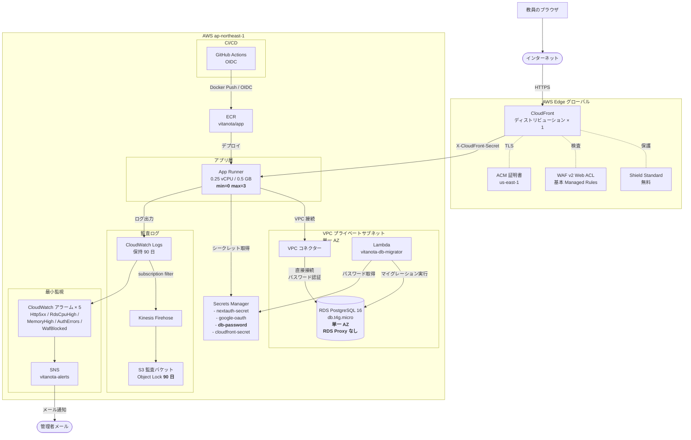
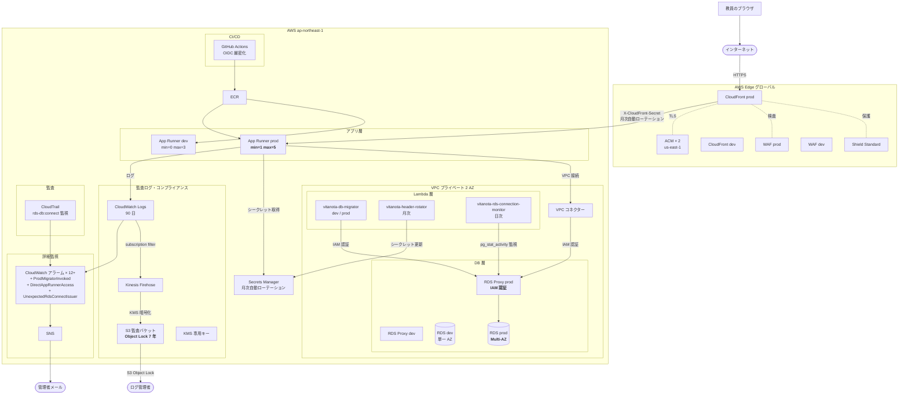

# vitanota デプロイメント フェーズ

**作成日**: 2026-04-15
**目的**: MVP ローンチ時点と本格稼働時点のインフラ構成を明示し、段階的移行の道筋を示す
**スコープ**: Unit-01 + Unit-02 インフラ全体

このドキュメントは **インフラ構成の段階的進化** を単一の真実源として管理する。
個別の詳細は `aidlc-docs/construction/unit-01/infrastructure-design/infrastructure-design.md` を参照。

---

## 背景: なぜ段階的デプロイか

当初の設計（Unit-01 infrastructure-design.md）は**本格稼働を想定したフル構成**で、月額 ¥22,000〜30,000 の費用を要する。MVP の実運用制約を踏まえて以下を決定した:

- **開発者 1 人**
- **2 週間でローンチ**（1 校・β 利用）
- **セキュリティは妥協しない**（CloudFront + WAF + 暗号化 + 監査ログは必須）
- **コストは MVP 規模に合わせる**（¥8,000 以下が望ましい）
- **移行可能性**: 本格稼働時に設計を捨てず、追加する形で拡張

この要件に合わせ、**Phase 1 (MVP) → Phase 2 (Production) の 2 段階デプロイ**を採用する。

---

## Phase 1: MVP インフラ構成

### アーキテクチャ図



### Phase 1 の構成要素

| 要素 | 設定 |
|---|---|
| 環境 | **単一環境**（dev / prod を分離しない） |
| RDS | **t4g.micro 単一 AZ**・削除保護有効・自動バックアップ 1 日 + 手動 snapshot 7 日（※下記） |
| RDS Proxy | **なし**（App Runner から直接接続、パスワード認証） |
| App Runner | **min=0 max=3**（スケールゼロで idle 時コスト削減） |
| CloudFront | 1 ディストリビューション + WAF Web ACL |
| WAF | Managed Rules（Common/SQLi/KnownBadInputs/IpReputation）+ RateLimit |
| Shield | Standard（無料・自動） |
| Secrets Manager | **db-password** を含む 4-5 件 |
| Lambda | **db-migrator** + **snapshot-manager**（header-rotator・rds-monitor は省略） |
| CloudWatch アラーム | **5 個**（必須のみ） |
| S3 監査ログ | Object Lock **90 日**（後で 7 年に拡張可能） |
| Permission Boundary | 最小版（`iam:*` 変更拒否のみ） |
| GitHub OIDC | main ブランチ + production environment 限定 |

### Phase 1 月額コスト

| リソース | 月額 |
|---|---|
| RDS t4g.micro 単一 AZ | $15 |
| App Runner min=0 | $6-15 |
| CloudFront | $3-8 |
| WAF Web ACL + ルール | $10 |
| S3 + KMS + Firehose | $3-5 |
| Secrets Manager | $2 |
| Route 53 | $0.50 |
| ECR | $1 |
| Lambda | ~$0 |
| **合計** | **約 $40-55/月（¥6,000-8,000）** |

### RDS バックアップ戦略（Free Tier 対応）

AWS アカウント作成から 12 ヶ月は Free Tier 制約下で、RDS 自動バックアップの合計ストレージが 20 GB 上限。`backupRetention: 7 日` では割当量超過エラーで RDS 作成が失敗するため、以下の 2 層構成で実効的な 7 日復旧ウィンドウを確保する。

- **L1: 自動バックアップ（retention = 1 日）** — AWS マネージド PITR。24 時間以内の事故復旧用
- **L2: 手動 snapshot（7 日保持）** — `vitanota-prod-snapshot-manager` Lambda が EventBridge cron（JST 03:00 毎日）で作成、7 日以上古い snapshot を自動削除
  - snapshot 命名: `vitanota-prod-manual-YYYYMMDD`
  - CloudWatch Logs: `/aws/lambda/vitanota-prod-snapshot-manager`（保持 30 日）
  - IAM: `CreateDBSnapshot` / `DeleteDBSnapshot` は RDS インスタンス ARN + manual snapshot ARN に限定、`DescribeDBSnapshots` のみ `*`（AWS 仕様）

**Free Tier 卒業後（2027-04-07 以降）の移行**：`backupRetention: 7` に戻して snapshot-manager を停止（または保持期間延長に役割変更）する。migration は `cdk deploy` 1 回で完了。

### Phase 1 で達成するもの

- ✅ 学校 1 校での β 利用
- ✅ SP-U02-04 8 層防御（is_public 漏えい物理防止）
- ✅ RLS によるテナント隔離
- ✅ TLS 暗号化（CloudFront + RDS）+ 保管時暗号化（RDS KMS）
- ✅ WAF による攻撃遮断
- ✅ Auth.js database セッション戦略（即時失効可能）
- ✅ 監査ログ 90 日保持（教育機関の β 運用として妥当）
- ✅ CDK で完全再現可能
- ✅ 必須アラート 5 種

### Phase 1 で妥協しているもの（Phase 2 で追加）

| 項目 | 理由 | Phase 2 移行時の手間 |
|---|---|---|
| RDS Multi-AZ | AZ 障害時のダウンタイム許容 | `multiAz: true` に変更・メンテナンスウィンドウで有効化 |
| RDS Proxy | 接続プールは node-postgres Pool で対応 | 新規リソース追加・`DATABASE_URL` 切替 |
| dev 環境 | ローカル Docker Compose で代替 | 既存 CDK スタックを dev context で再デプロイ |
| Header rotator Lambda | 四半期手動ローテーションで OK | Lambda + EventBridge 追加 |
| RDS connection monitor Lambda | CloudWatch メトリクスで代替 | Lambda 追加 |
| アラーム 12 個 | MVP は 5 個で十分 | CloudWatch アラーム追加 |
| S3 Object Lock 7 年 | 90 日で MVP は十分 | S3 バケット設定変更 |
| 論点 M Phase 2 API | 退会は手動 SQL 対応 | API + Service 実装（別 Unit で） |
| 論点 A 月次ローテーション自動化 | 手動ローテーションで MVP OK | Lambda + EventBridge |

---

## Phase 2: 本格稼働インフラ構成

### アーキテクチャ図



### Phase 2 の追加要素

| 追加 | 設定 |
|---|---|
| 環境分離 | dev + prod の 2 環境 |
| RDS | **prod Multi-AZ**・RDS Proxy × 2（dev/prod）・**IAM 認証** |
| App Runner | prod は min=1（常時稼働で SLA 向上） |
| CloudFront / WAF | dev / prod × 2 ディストリビューション |
| Lambda | header-rotator + rds-connection-monitor + EventBridge Scheduler |
| S3 監査ログ | Object Lock 7 年・専用 KMS キー |
| CloudTrail | rds-db:connect 監査 |
| CloudWatch アラーム | 12+ 個（Permission Boundary 違反検知等含む） |
| WAF ルール | journal-entry-post-bodycheck Count → Block 段階切替 |
| IAM | Permission Boundary 完全版・ロール 8 個以上 |

### Phase 2 月額コスト

| リソース | dev | prod | 合計 |
|---|---|---|---|
| RDS | $15（単一 AZ）| $50（Multi-AZ t4g.small）| $65 |
| RDS Proxy | $15 | $15 | $30 |
| App Runner | $0-5 | $20-40 | $20-45 |
| CloudFront + WAF | $8 | $15 | $23 |
| Lambda + Scheduler | ~$0 | ~$0 | ~$0 |
| S3 監査ログ | - | $5-10 | $5-10 |
| Secrets Manager | $2 | $2 | $4 |
| 監視・その他 | $2 | $5 | $7 |
| **合計** | **~$42** | **~$112** | **~$155-175/月（¥23,000-26,000）**|

---

## Phase 1 → Phase 2 移行計画

### 移行トリガー

以下のいずれかに該当したら Phase 2 への移行を開始:

1. **ユーザー数が 3 校以上** or **学校あたり教員 50 名以上**に成長
2. **商用化が確定**（契約締結・有料ローンチ）
3. **AZ 障害で実害**が発生（Multi-AZ が必要と判断）
4. **コンプライアンス監査**（ISMS / P マーク）で Object Lock 7 年が要求される
5. **論点 M Phase 2 API**（退会 API）が必要になる（運用負荷の観点から）

### 段階的移行ステップ

| ステップ | 作業 | ダウンタイム | 工数 |
|---|---|---|---|
| **S1: RDS Multi-AZ 化** | CDK 修正 + `multiAz: true` | 数分（AZ フェイルオーバー）| 2h |
| **S2: RDS Proxy 追加** | CDK で新規リソース追加・`DATABASE_URL` 切替 | 数分（接続切替）| 4h |
| **S3: IAM 認証への切替** | `db-auth.ts` を復活・App Runner ロール権限追加 | 数分 | 3h |
| **S4: dev 環境追加** | 既存スタックを dev context で再デプロイ | なし | 4h |
| **S5: 監視 Lambda 追加** | header-rotator + rds-connection-monitor | なし | 6h |
| **S6: S3 Object Lock 7 年化** | 既存バケットの Retention 設定変更 | なし | 1h |
| **S7: アラーム拡充** | 12 個まで追加 | なし | 3h |
| **S8: 論点 M Phase 2 API 実装** | 退会 API + Service + Lambda バッチ | なし | 18h |
| **合計** | | **約 10 分** | **約 41h** |

**MVP で書いた CDK コードの大半が再利用可能**。新規追加する形で拡張。

### データ移行（万が一必要な場合）

Phase 1 の RDS → Phase 2 の強化 RDS への移行は以下のパターン:

#### パターン A: インスタンスクラスの変更のみ（同じインスタンス）
```bash
aws rds modify-db-instance \
  --db-instance-identifier vitanota-mvp \
  --db-instance-class db.t4g.small \
  --apply-immediately
```
**所要時間**: 5-10 分・自動フェイルオーバーで実質ダウンタイム数秒

#### パターン B: スナップショット → 新インスタンス
```bash
# 1. スナップショット作成
aws rds create-db-snapshot \
  --db-instance-identifier vitanota-mvp \
  --db-snapshot-identifier vitanota-mvp-pre-migration

# 2. 新インスタンス作成
aws rds create-db-instance-from-db-snapshot \
  --db-instance-identifier vitanota-prod \
  --db-snapshot-identifier vitanota-mvp-pre-migration \
  --multi-az

# 3. アプリの接続先切替（Secrets Manager 更新）
# 4. 旧インスタンス削除
```
**所要時間**: 15-30 分

#### パターン C: 完全な別 AWS アカウントへ
スナップショットのクロスアカウント共有 + 復元で可能。所要時間: 30-60 分。

---

## 論点・リスクとの紐づき

### Phase 1 で解決する論点

- ✅ 論点 C（JWT 失効不可）→ Auth.js database 戦略で解決済み（Step 8）
- ✅ 論点 D（監査ログ）→ S3 監査ログ 90 日で MVP 対応（7 年は Phase 2）
- ✅ 論点 E（GitHub Actions 権限）→ OIDC 厳密化で解決済み
- ✅ 論点 F（PII エッジキャッシュ混入）→ SP-U02-04 8 層防御で解決済み
- ✅ 論点 G（Lambda マイグレーター権限分離）→ 3 ロール分離で解決済み
- ✅ 論点 H（マルチテナント隔離）→ 統合テスト 44 件で検証済み
- ✅ 論点 L（サプライチェーン）→ OSV-Scanner + gitleaks + SHA 固定で解決済み

### Phase 1 では妥協し Phase 2 で再活性化する論点

- ⏸️ 論点 A（App Runner オリジン保護強化）→ Phase 2 で月次自動ローテーション Lambda
- ⏸️ 論点 B（RDS Proxy IAM 認証監査）→ Phase 2 で Proxy + CloudTrail 再導入
- ⏸️ 論点 M Phase 2（退会 API）→ Phase 2 で実装

### Phase 1 では存在しない論点

- ❌ 論点 R1（RDS Proxy セッションピンニング）→ **Proxy 未使用のため発生しない**（Phase 2 で Proxy 追加時に再評価）

---

## 関連ドキュメント

- 設計の詳細: `aidlc-docs/construction/unit-01/infrastructure-design/infrastructure-design.md`（Phase 2 相当のフル設計）
- セキュリティレビュー: `aidlc-docs/inception/requirements/security-review.md`
- 運用リスク: `aidlc-docs/construction/unit-02/nfr-design/operational-risks.md`
- ユーザーライフサイクル: `aidlc-docs/construction/user-lifecycle-spec.md`
- シーケンス図: `aidlc-docs/construction/sequence-diagrams.md`
- ER 図: `aidlc-docs/construction/er-diagram.md`

---

## 変更履歴

- **2026-04-15 初版**: Phase 1（MVP）/ Phase 2（本格稼働）の 2 段階構成を確定
  - MVP: App Runner min=0・RDS 単一 AZ・Proxy なし・単一環境・月 ¥6,000-8,000
  - Production: 既存 Unit-01 infrastructure-design.md のフル構成・月 ¥23,000-26,000
  - 移行工数: 約 41 時間（ダウンタイム最小 10 分）
