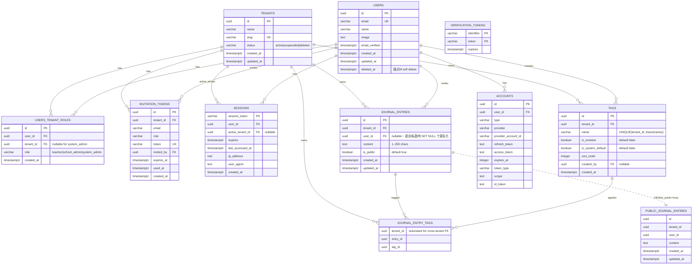

# vitanota データベース ER 図

**最終更新**: 2026-04-15（論点 M ユーザーライフサイクル Phase 1・migration 0006）
**スコープ**: Unit-01（認証・テナント基盤）+ Unit-02（日誌・感情記録コア）

## 更新ルール

このファイルは **DB スキーマの単一真実源（Single Source of Truth）**。以下のタイミングで必ず更新する：

- スキーマ変更を伴うコード生成・マイグレーション追加時
- 新規テーブル・列・FK・VIEW の追加
- 既存制約の変更
- RLS ポリシーの変更（テキスト補足）

更新時は「最終更新」日付とバージョン注記を必ず更新する。

---

## ER 図（Mermaid）

---

## 主要な設計ポイント

### 1. マルチテナント設計
- **テナント境界**: 全業務テーブル（`journal_entries`・`tags`・`journal_entry_tags`）に `tenant_id` を保持
- **ユーザーは複数テナント所属可**: `users_tenant_roles` 中間テーブルで多対多関係
- **アクティブテナント**: `sessions.active_tenant_id` で現在のテナントコンテキストを記録

### 2. SP-U02-04 Layer 8: 複合 FK によるクロステナント参照物理防止
- `journal_entries` と `tags` に `(id, tenant_id)` の複合 UNIQUE 制約
- `journal_entry_tags` が `tenant_id` を冗長保持し、複合 FK で以下を強制:
  - `(entry_id, tenant_id)` → `journal_entries(id, tenant_id)`
  - `(tag_id, tenant_id)` → `tags(id, tenant_id)`
- テナント A のエントリとテナント B のタグの紐づけは **DB エンジンが FK violation で即拒否**

### 3. SP-U02-04 Layer 4: public_journal_entries VIEW
- `WHERE is_public = true` を VIEW 定義に内包
- `is_public` 列自体を SELECT に含めない（物理的に露出不可）
- `security_barrier = true` でサブクエリ経由の情報漏えいを防止

### 4. RLS ポリシー（SP-U02-02）

| テーブル | ポリシー | 条件 |
|---|---|---|
| `journal_entries` | `journal_entry_public_read` (SELECT) | `is_public = true AND tenant_id = current_setting('app.tenant_id')` |
| `journal_entries` | `journal_entry_owner_all` (ALL) | `user_id = current_setting('app.user_id') AND tenant_id = ...` |
| `tags` | `tags_tenant_read` (SELECT) + `tags_tenant_write` (ALL) | `tenant_id = current_setting('app.tenant_id')` |
| `journal_entry_tags` | `journal_entry_tags_tenant` (ALL) | `tenant_id = current_setting('app.tenant_id')` |
| `sessions` | `sessions_owner_read` (SELECT) | `user_id = current_setting('app.user_id')` |

**Fail-safe**: `current_setting(..., true)` の `missing_ok=true` で未設定時 NULL → uuid キャスト比較で全拒否

### 5. Auth.js database セッション戦略（SP-07）

- `sessions` テーブルで JWT 失効不可問題を解消
- アイドルタイムアウト 30分・絶対最大寿命 8時間（アプリ層で制御）
- ロール変更時・テナント停止時は `DELETE FROM sessions WHERE user_id = ?` で即時失効可能

### 6. カスケード削除

| 親 → 子 | 動作 |
|---|---|
| `tenants` 削除 → `users_tenant_roles` | CASCADE |
| `tenants` 削除 → `invitation_tokens` | CASCADE |
| `tenants` 削除 → `sessions.active_tenant_id` | CASCADE |
| `tenants` 削除 → `journal_entries` / `tags` / `journal_entry_tags` | CASCADE |
| `users` 削除 → `users_tenant_roles` / `accounts` / `sessions` | CASCADE |
| `users` 削除 → `journal_entries` | CASCADE |
| `journal_entries` 削除 → `journal_entry_tags` | CASCADE（複合 FK） |
| `tags` 削除 → `journal_entry_tags` | CASCADE（複合 FK、エントリ本体は残る） |
| `users` 削除 → `journal_entries.user_id` | **SET NULL（論点 M）** 公開エントリは匿名化保持 |
| `users` 削除 → `tags.created_by` | **SET NULL（論点 M）** タグ本体は残る |
| `users` 削除 → `invitation_tokens.invited_by` | **SET NULL（論点 M）** 招待履歴は監査証跡として残る |

---

## テーブル・VIEW 一覧

### Unit-01（認証・テナント基盤）
- `tenants` - テナント（学校）
- `users` - ユーザー（教員・管理職・system_admin）
- `users_tenant_roles` - ユーザー × テナント × ロール（多対多）
- `invitation_tokens` - 招待トークン
- `accounts` - Auth.js OAuth 連携
- `sessions` - Auth.js database セッション（Unit-02 で追加）
- `verification_tokens` - Auth.js 標準

### Unit-02（日誌・感情記録コア）
- `journal_entries` - 日誌エントリ
- `tags` - タグ（感情・業務を `is_emotion` フラグで統合）
- `journal_entry_tags` - エントリ × タグ中間テーブル（複合 FK）
- `public_journal_entries` (VIEW) - 共有タイムライン専用 VIEW

### Unit-03 以降（未実装）
- 将来追加予定

---

## マイグレーション履歴

| No | ファイル | 内容 | ユニット |
|---|---|---|---|
| 0001 | `migrations/0001_unit01_initial.sql` | Unit-01 初期スキーマ（tenants・users・user_tenant_roles・accounts・invitation_tokens） | Unit-01 |
| 0002 | `migrations/0002_unit02_sessions.sql` | sessions + verification_tokens + RLS | Unit-02（Unit-01 遡及） |
| 0003 | `migrations/0003_unit02_journal_core.sql` | journal_entries / tags / journal_entry_tags + 複合 UNIQUE + 複合 FK | Unit-02 |
| 0004 | `migrations/0004_unit02_journal_rls.sql` | RLS ポリシー（SP-U02-02 2ポリシー + tags + journal_entry_tags） | Unit-02 |
| 0005 | `migrations/0005_unit02_public_view.sql` | public_journal_entries VIEW（SP-U02-04 Layer 4） | Unit-02 |
| 0006 | `migrations/0006_user_lifecycle.sql` | 論点 M Phase 1: FK 修正 (SET NULL)・users.deleted_at 追加 | Unit-02 + Unit-01 遡及 |

---

## 変更履歴

- **2026-04-15 初版**: Unit-01 + Unit-02 Step 1-3 完了時点の DB 構造を反映
- **2026-04-15 改訂1**: 論点 M Phase 1 反映
  - `users.deleted_at` 追加（soft delete）
  - `journal_entries.user_id` を nullable に変更 + FK を SET NULL に
  - `tags.created_by` の FK を SET NULL に
  - `invitation_tokens.invited_by` の FK を SET NULL に
  - migration 0006 追加
