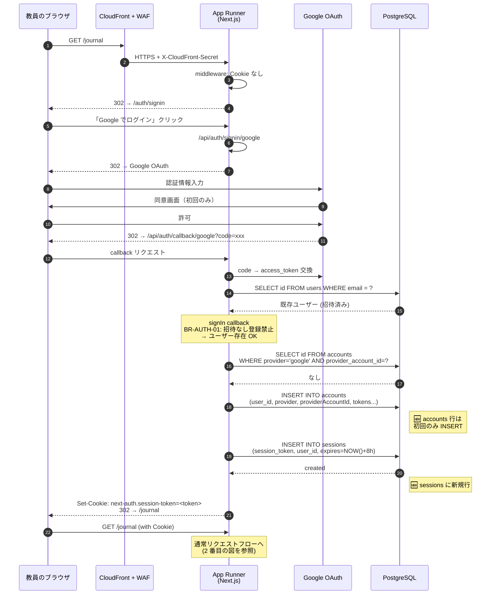
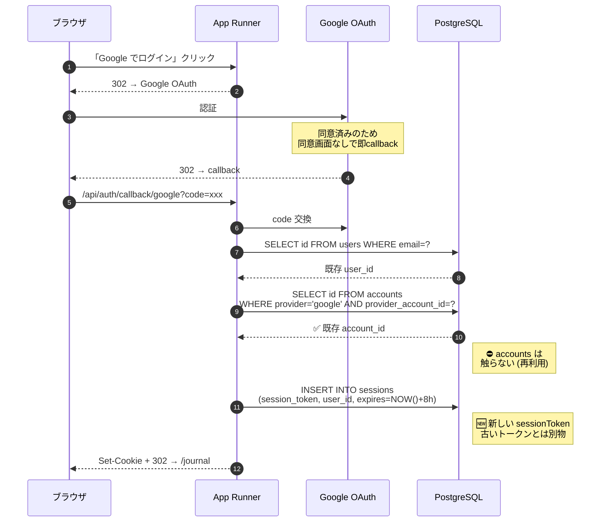
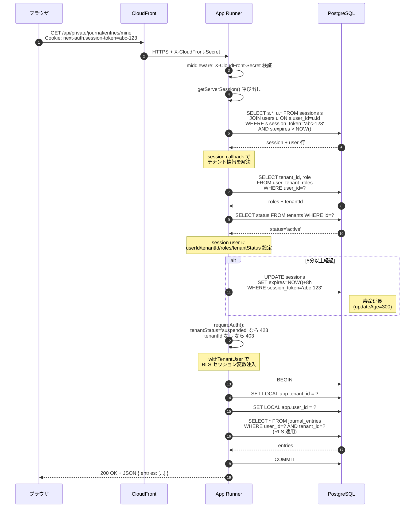
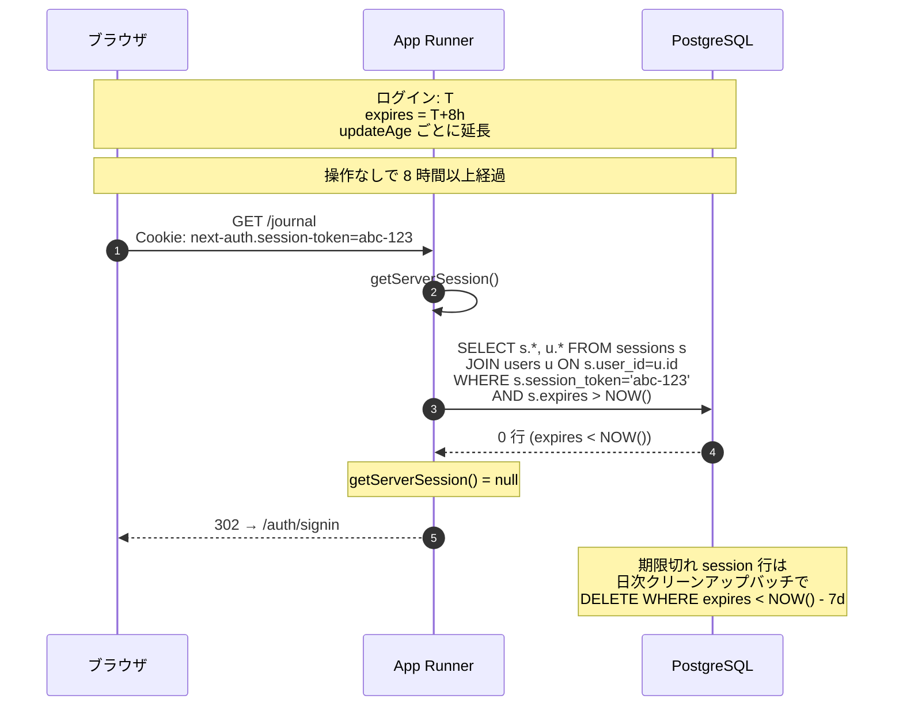
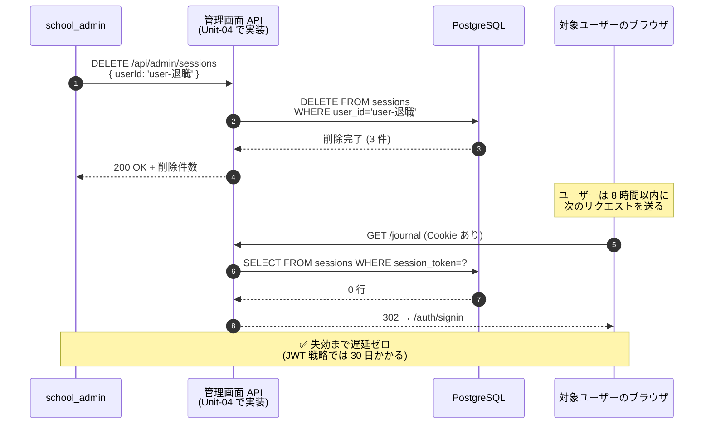
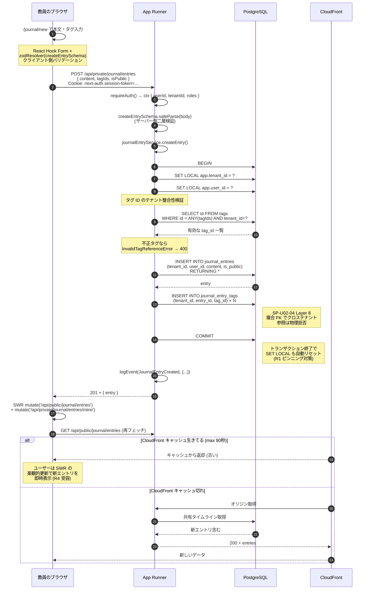
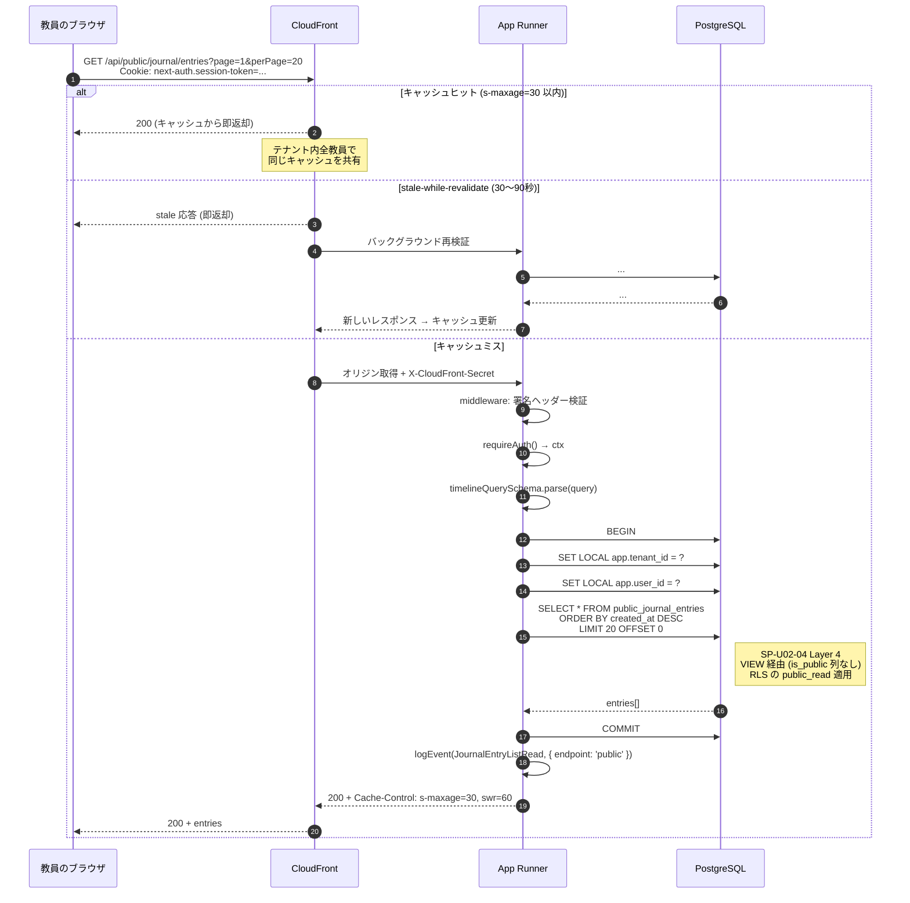
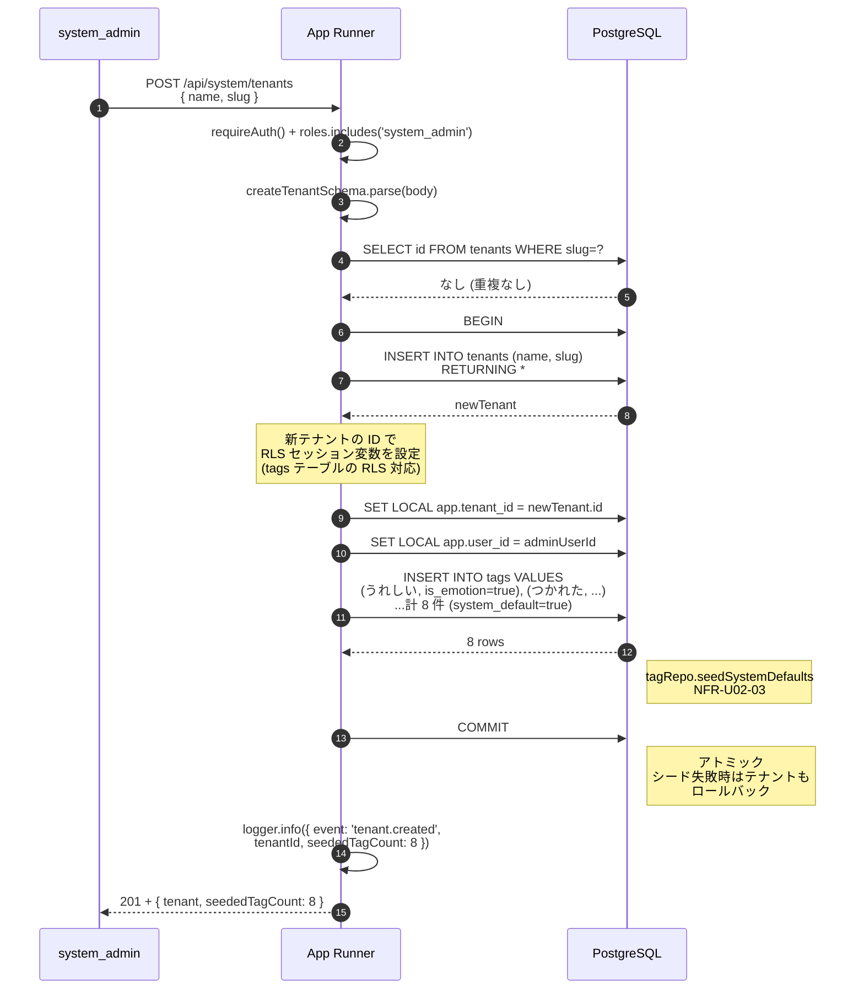
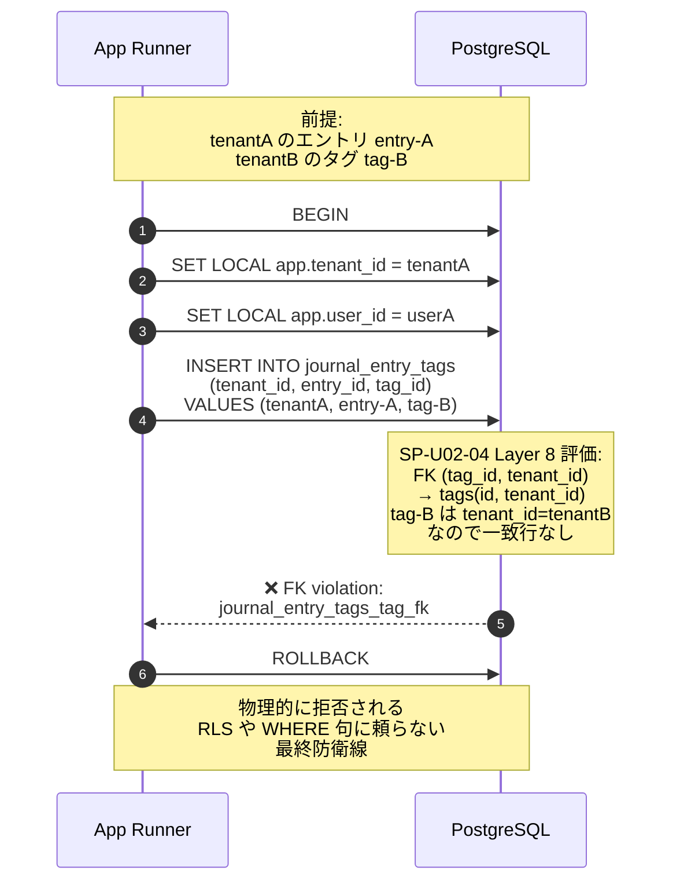

# vitanota シーケンス図

**最終更新**: 2026-04-15（Unit-02 Step 8 完了時点）
**スコープ**: Unit-01 認証基盤 + Unit-02 日誌コア
**関連**: `aidlc-docs/construction/er-diagram.md`

## 更新ルール

- 主要な業務フローや認証フローに変更があった場合は本ファイルも更新
- 新しいユースケースが追加されたら追記
- ER 図と同様、本ファイルが「動作の単一真実源」

---

## 1. 初回ログイン（Google OAuth・新規 OAuth 連携）

招待済みユーザーが初めて Google でログインするフロー。
**`accounts` への INSERT はこの時点のみ**（次回以降は再利用）。



---

## 2. 再ログイン（既存 OAuth 連携あり）

ログアウト後の再ログイン。`accounts` は再利用、`sessions` のみ新規作成。



---

## 3. 通常リクエスト（認証済み API 呼び出し）

ログイン後、保護された API を呼ぶ標準フロー。



---

## 4. ログアウト

```mermaid
sequenceDiagram
    autonumber
    participant U as ブラウザ
    participant App as App Runner
    participant DB as PostgreSQL
    participant Logs as CloudWatch Logs

    U->>App: POST /api/auth/signout
    App->>App: signOut callback

    App->>DB: DELETE FROM sessions<br/>WHERE session_token='abc-123'
    DB-->>App: deleted
    Note right of DB: ⛔ accounts/users は残る<br/>sessions の 1 行のみ削除

    App->>App: events.signOut hook
    App->>Logs: logEvent(SessionRevoked,<br/>{ sessionId, userId, reason: 'user_logout' })

    App-->>U: Set-Cookie: ...=; expires=過去<br/>302 → /auth/signin

    Note over U: 以降のリクエストは<br/>Cookie はあっても DB に行がない<br/>→ getServerSession() = null<br/>→ 401
```

---

## 5. セッション自動失効（8時間経過）



---

## 6. 強制ログアウト（管理者操作・将来 Unit-04 admin 機能）

退職者の即時アクセス遮断・トークン流出時の対応。
**今は手動 SQL のみ、Unit-04 で管理画面 API を提供予定**。



**SQL ベースの即時失効パターン**（管理者向け Runbook）:

```sql
-- 特定ユーザーの全セッション失効
DELETE FROM sessions WHERE user_id = '...';

-- テナント停止時の全ユーザーセッション失効
DELETE FROM sessions
  WHERE user_id IN (
    SELECT user_id FROM user_tenant_roles WHERE tenant_id = '...'
  );

-- 流出した特定セッショントークンの失効
DELETE FROM sessions WHERE session_token = '...';
```

---

## 7. エントリ作成（US-T-010）

教員が日誌を投稿し、共有タイムラインへ反映されるまで。



---

## 8. 共有タイムライン取得（US-T-014）

`/api/public/journal/entries` のキャッシュ込み読み取りフロー。



---

## 9. テナント作成 + デフォルトタグシード（US-S-001 + NFR-U02-03）

system_admin が新規学校テナントを作成し、8 件のデフォルトタグが自動シードされるフロー。



---

## 10. クロステナント参照拒否（SP-U02-04 Layer 8 物理防御）

アプリのバグ・生 SQL のいずれでも、テナント A のエントリにテナント B のタグを紐づけられない様子。



---

## 関連ドキュメント

- **ER 図**: `aidlc-docs/construction/er-diagram.md`
- **API 仕様**: `aidlc-docs/construction/unit-02/code/api-contracts.md` / `openapi.yaml`
- **NFR パターン**: `aidlc-docs/construction/unit-02/nfr-design/nfr-design-patterns.md`
- **セキュリティレビュー**: `aidlc-docs/inception/requirements/security-review.md`
- **運用リスク**: `aidlc-docs/construction/unit-02/nfr-design/operational-risks.md`

---

## 変更履歴

- **2026-04-15 初版**: Unit-01 + Unit-02 Step 8 完了時点のシーケンス図を整備
  - 認証: 初回ログイン / 再ログイン / 通常リクエスト / ログアウト / 自動失効 / 強制ログアウト
  - 業務: エントリ作成 / 共有タイムライン取得 / テナント作成 + シード / クロステナント参照拒否
