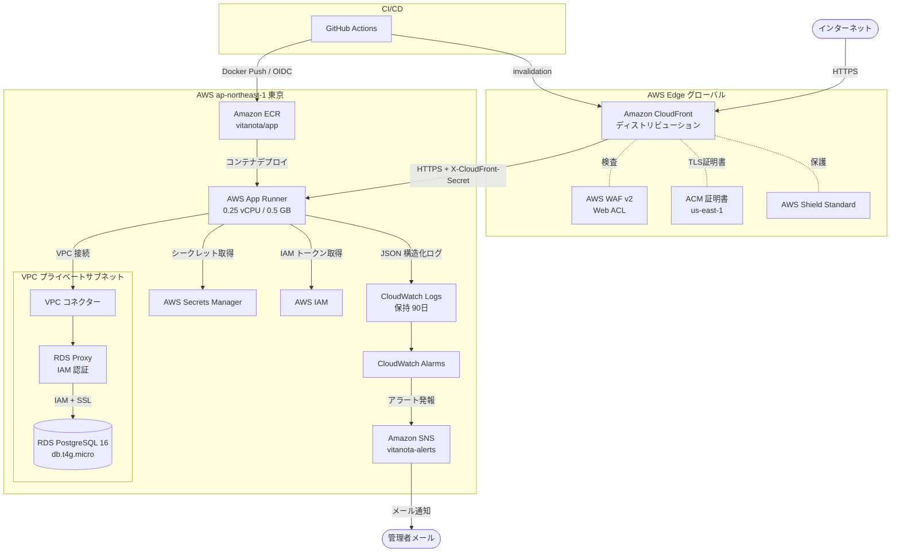

# Unit-01 インフラ設計

## 概要

Unit-01（認証・テナント基盤）のインフラ設計。論理コンポーネントを AWS サービスにマッピングし、dev / prod 2環境の構成を定義する。

---

## コンポーネント → AWSサービス マッピング

| 論理コンポーネント | AWSサービス | 環境 |
|---|---|---|
| 監査ログ保管 | Amazon S3 `vitanota-audit-logs-prod` + Object Lock 7年 | prod |
| 監査ログ転送 | Amazon Kinesis Data Firehose `vitanota-audit-firehose` | prod |
| 監査ログ暗号鍵 | AWS KMS `vitanota-audit-kms` | prod |
| CDN / エッジキャッシュ | Amazon CloudFront | dev / prod |
| Web Application Firewall | AWS WAF v2（CloudFront 関連付け） | dev / prod |
| DDoS 保護 | AWS Shield Standard（無料・自動適用） | dev / prod |
| TLS 証明書 | AWS Certificate Manager（us-east-1、CloudFront 用） | dev / prod |
| Logger | Amazon CloudWatch Logs | dev / prod |
| SecretsLoader | AWS Secrets Manager | dev / prod |
| DbAuthProvider | AWS IAM（RDS Proxy IAM 認証） | dev / prod |
| DbClient | Amazon RDS Proxy → RDS PostgreSQL 16 | dev / prod |
| RateLimiter | App Runner コンテナ内メモリ + WAF レート制限 | dev / prod |
| HealthCheck | App Runner ヘルスチェック（/api/health） | dev / prod |
| Next.js アプリ全体 | AWS App Runner（CloudFront オリジン） | dev / prod |
| DB マイグレーションランナー | AWS Lambda（`vitanota-db-migrator`） | dev / prod |

---

## エッジ層：Amazon CloudFront + AWS WAF

### 構成方針

CloudFront を App Runner の前段に配置し、以下の役割を担う：
1. **エッジキャッシュ**：`Cache-Control: s-maxage=N, stale-while-revalidate=M` ヘッダーを尊重し、テナント内で共有タイムライン等を高速化（Unit-02 NFR-U02-02 で活用）
2. **WAF 関連付け**：SQL インジェクション・XSS・共通攻撃のブロック（Security Baseline の多層防御）
3. **DDoS 保護**：Shield Standard の無料保護
4. **TLS 終端**：ACM 発行の証明書を使用し、カスタムドメインで TLS を終端
5. **オリジンシールド**：App Runner への直アクセスを制限

### CloudFront ディストリビューション

| 項目 | dev | prod |
|---|---|---|
| オリジン | App Runner dev URL（`*.awsapprunner.com`） | App Runner prod URL（`*.awsapprunner.com`） |
| カスタムドメイン | `dev.vitanota.example.com` | `vitanota.example.com` |
| TLS 証明書 | ACM（us-east-1 必須） | ACM（us-east-1 必須） |
| 最低 TLS バージョン | TLSv1.2_2021 | TLSv1.2_2021 |
| HTTP → HTTPS リダイレクト | 強制 | 強制 |
| 価格クラス | PriceClass_200（日本含む） | PriceClass_200 |
| キャッシュポリシー（API） | `CachingDisabled`（既定）。`Cache-Control` ヘッダーを持つレスポンスのみ個別ポリシーでキャッシュ可 | 同左 |
| オリジンリクエストポリシー | `AllViewer`（`Host` を除く全ヘッダー・Cookie・クエリを転送） | 同左 |
| レスポンスヘッダーポリシー | セキュリティヘッダー（HSTS・X-Content-Type-Options・Referrer-Policy） | 同左 |

### キャッシュ無効化運用

- **Next.js アプリコード/静的アセット更新時**: デプロイパイプラインの最後で `aws cloudfront create-invalidation --paths "/*"` を実行（GitHub Actions の手順に追加）
- **API レスポンスの誤キャッシュ緊急時**: 手動 invalidation（運用 Runbook 化）

### AWS WAF v2 Web ACL

| ルール | アクション | 備考 |
|---|---|---|
| AWSManagedRulesCommonRuleSet | Block | OWASP Top 10 共通ルール |
| AWSManagedRulesKnownBadInputsRuleSet | Block | 既知の悪意あるペイロード |
| AWSManagedRulesSQLiRuleSet | Block | SQL インジェクション |
| AWSManagedRulesAmazonIpReputationList | Block | AWS 脅威情報IPリスト |
| レート制限（IP単位） | Block（5分間1000リクエスト超過） | ブルートフォース対策（Unit-01 のアプリ内レート制限と二重化） |
| 地理的制限 | カウントのみ（ブロックなし） | 将来の日本国内限定運用に備えて計測 |

### X-CloudFront-Secret ヘッダー月次自動ローテーション（P2-A-1 対応・2026-04-15 追加）

Unit-01 当初は四半期（90日）の手動ローテーションだったが、論点 A（App Runner パブリックエンドポイント漏えい時の影響）対策として**月次自動ローテーション**に変更する。

**構成**:
- Lambda 関数 `vitanota-header-rotator`（Node.js 20、ARM64、VPC 不要）
- EventBridge Scheduler: 月初 01:00 JST トリガー
- Secrets Manager シークレット `vitanota/cloudfront-secret` に `current_value` と `previous_value` を保持
- 24時間の猶予期間で新旧両方を受容（App Runner ミドルウェア）

**ローテーションフロー**:
```
Day 1 00:00 JST
  1. 新しいランダム値（32バイト URL-safe base64）を生成
  2. Secrets Manager: previous_value = current_value, current_value = new_value
  3. CloudFront オリジンカスタムヘッダーを new_value に更新
  4. App Runner ミドルウェアは SecretsLoader 経由で両方を受容

Day 2 00:00 JST（次回トリガー）
  5. previous_value をクリア（新 current_value のみ有効化）
```

**App Runner ミドルウェア側の実装**:
```ts
// middleware.ts
const { current, previous } = await getSecret('vitanota/cloudfront-secret')
const received = req.headers.get('X-CloudFront-Secret')
if (received !== current && received !== previous) {
  return new NextResponse('Forbidden', { status: 403 })
}
```

**IAM 実行ロール**（`vitanota-header-rotator-role`）:
```
secretsmanager:GetSecretValue / PutSecretValue — 対象: vitanota/cloudfront-secret
cloudfront:GetDistributionConfig / UpdateDistribution — 対象: 該当ディストリビューション
logs:* — Lambda 実行ログ
```

**信頼ポリシー**: `lambda.amazonaws.com` のみ
**コスト**: 月1実行、実質ゼロ

---

### App Runner 直接アクセス検知（P2-A-2 対応・2026-04-15 追加）

X-CloudFront-Secret ヘッダー検証で既にブロックはしているが、**攻撃試行の早期検知**のため、直接アクセス試行を監視する。

**構成**:
- CloudWatch Logs Metric Filter: App Runner アクセスログから `X-Forwarded-For` が CloudFront IP 範囲外のリクエストを検出
- Alarm: 5分間に10回以上で発報
- SNS: `vitanota-alerts` → 管理者メール

**Metric Filter パターン**:
```
{ ($.xForwardedFor NOT IN CLOUDFRONT_IP_RANGES) && ($.path != "/api/health") }
```

**注記**: CloudFront の IP 範囲は AWS 公開の `ip-ranges.json` の `CLOUDFRONT` サービスから取得。範囲は変動するため、週次で更新するシェルスクリプトを運用 Runbook に記載。

**既存防御との関係**: X-CloudFront-Secret 検証で既にブロック済み。これは**検知・アラート専用**で、攻撃の早期発見とヘッダー値漏えいの間接的指標として機能する。

---

### オリジン保護（App Runner への直アクセス防止）

App Runner はパブリックエンドポイントを持つため、CloudFront 経由以外からのアクセスを防ぐ必要がある。

**実装方法**:
1. CloudFront のオリジンリクエストに**カスタムヘッダー** `X-CloudFront-Secret: <ランダム文字列>` を付与（Secrets Manager で管理）
2. App Runner 側（Next.js ミドルウェア）で同ヘッダーを検証し、不一致なら 403 返却
3. ヘッダー値は定期的にローテーション（運用 Runbook 化）

**代替案**: App Runner の VPC 専用化は現時点でサポート外のため、カスタムヘッダー方式を採用

---

## コンピューティング：AWS App Runner

### インスタンス構成

| 項目 | dev | prod |
|---|---|---|
| vCPU | 0.25 | 0.25 |
| メモリ | 0.5 GB | 0.5 GB |
| 最小インスタンス数 | 0（リクエストベース） | 1（常時起動） |
| 最大インスタンス数 | 3 | 5 |
| ヘルスチェックパス | /api/health | /api/health |
| ヘルスチェック間隔 | 10 秒 | 10 秒 |

**注記（メモリリスク）**: 0.5 GB は Next.js の実行に対してタイトである（Next.js 起動時に約 300〜400 MB 消費）。デプロイ後は CloudWatch Metrics の`MemoryUtilization`を監視し、OOM（メモリ不足終了）が発生した場合は 0.5 vCPU / 1 GB に即時スケールアップすること。

### VPC コネクター

App Runner はパブリックネットワークで動作するが、VPC コネクターを介してプライベートサブネット内の RDS Proxy に接続する。

```
App Runner（パブリック）
        |
  VPC コネクター（apprunner-vpc-connector）
        |
  VPC プライベートサブネット
        |
  RDS Proxy → RDS PostgreSQL
```

### コンテナレジストリ

- **サービス**: Amazon ECR（Elastic Container Registry）
- **リポジトリ名**: `vitanota/app`
- **イメージタグ戦略**: `{env}-{git-sha}`（例: `prod-a1b2c3d`）
- **ライフサイクルポリシー**: 30世代を超えた古いイメージを自動削除

---

## DB マイグレーション：AWS Lambda（`vitanota-db-migrator`）

### 目的

踏み台 EC2 を作らずに、VPC プライベートサブネット内から RDS Proxy に直接接続して Drizzle Kit マイグレーションを実行するための専用 Lambda 関数。手動運用と CI/CD 自動化の両方を同じインターフェースでサポートする。

### 関数構成

| 項目 | dev | prod |
|---|---|---|
| 関数名 | `vitanota-db-migrator-dev` | `vitanota-db-migrator-prod` |
| ランタイム | Node.js 20 (ARM64) | Node.js 20 (ARM64) |
| メモリ | 512 MB | 512 MB |
| タイムアウト | 5分 | 15分 |
| VPC | RDS Proxy と同じプライベートサブネット | 同左 |
| トリガー | 手動 `aws lambda invoke` / GitHub Actions | 同左 |
| デプロイパッケージ | Drizzle Kit + `drizzle/` マイグレーションフォルダ + ハンドラ | 同左 |

### ハンドラ仕様

イベントペイロードで `command` を受け取り、対応する操作を実行する：

```json
{ "command": "migrate" }   // 未適用マイグレーションを全て適用
{ "command": "status" }    // 適用済み/未適用の一覧を返却
{ "command": "drop" }      // 開発環境のみ有効、全テーブル削除（prod では常に拒否）
```

**ハンドラ擬似コード**:
```ts
export const handler = async (event: { command: 'migrate' | 'status' | 'drop' }) => {
  const dbUrl = await buildDbUrl() // IAM トークンで RDS Proxy URL を構築
  switch (event.command) {
    case 'migrate':
      return await runMigrate(dbUrl)  // drizzle-kit migrate 相当
    case 'status':
      return await runStatus(dbUrl)
    case 'drop':
      if (process.env.ENV === 'prod') throw new Error('drop is disabled on prod')
      return await runDrop(dbUrl)
  }
}
```

### IAM ロール構成（P1-G で権限分離・2026-04-15 更新）

Lambda マイグレーターの権限は**3ロールに分離**し、最小権限原則を適用する。

#### 1. `vitanota-db-migrator-execute-role`（Lambda 実行ロール）

Lambda ランタイム自身が使用。マイグレーションの実行に必要な最小権限のみ。

```
rds-db:connect                        — 対象: arn:aws:rds-db:ap-northeast-1:*:dbuser:*/vitanota_app
secretsmanager:GetSecretValue         — 対象: arn:aws:secretsmanager:ap-northeast-1:*:secret:vitanota/*
logs:CreateLogGroup / CreateLogStream / PutLogEvents
ec2:CreateNetworkInterface / DescribeNetworkInterfaces / DeleteNetworkInterface  (VPC Lambda 必須)
```

**信頼ポリシー**: `lambda.amazonaws.com` のみ

#### 2. `vitanota-db-migrator-deploy-role`（コードデプロイ専用）

Lambda 関数コードの更新のみ可能。GitHub Actions OIDC（main ブランチ）からのみ引き受け可能。

```
lambda:UpdateFunctionCode             — 対象: vitanota-db-migrator-dev, vitanota-db-migrator-prod
lambda:PublishVersion                 — 対象: 同上
lambda:GetFunction                    — 対象: 同上
```

**信頼ポリシー**: GitHub Actions OIDC（`ref:refs/heads/main` のみ）

#### 3. `vitanota-db-migrator-invoke-role`（実行呼び出し専用）

Lambda 関数の invoke のみ可能。開発者 IAM User または CI から引き受ける。

```
lambda:InvokeFunction                 — 対象: vitanota-db-migrator-dev（全開発者）
lambda:InvokeFunction                 — 対象: vitanota-db-migrator-prod（特定 IAM User/グループのみ）
```

**信頼先**:
- `vitanota-db-migrator-dev-invokers` IAM グループ（全開発者）
- `vitanota-db-migrator-prod-invokers` IAM グループ（リリース担当者 3〜5名のホワイトリスト）
- GitHub Actions OIDC（Phase 2 自動化時に追加、`ref:refs/heads/main` かつ `environment:production`）

#### prod invoke の追加保護

- **特定 IAM User ホワイトリスト方式**で prod Lambda invoke を制限
- **CloudTrail で全 invoke を記録**（`lambda:Invoke` イベント）
- **prod invoke 発生時に SNS → 管理者メール通知**（CloudWatch Logs Insights + Metric Filter + Alarm `ProdMigratorInvoked`）
- **Lambda 関数側のハードコード保護**:
  ```ts
  if (event.command === 'drop' && process.env.ENV === 'prod') {
    throw new Error('drop is disabled on prod')
  }
  if (event.command === 'query' && process.env.ENV === 'prod') {
    throw new Error('arbitrary query is disabled on prod')
  }
  ```

### ネットワーク設定

- **サブネット**: RDS Proxy と同じプライベートサブネット（2 AZ）
- **セキュリティグループ**: `sg-db-migrator`
  - Outbound TCP 5432 → sg-rds-proxy
  - Outbound TCP 443 → 0.0.0.0/0（Secrets Manager / IAM 用）
- **RDS Proxy 側の許可**: `sg-rds-proxy` の Inbound に `sg-db-migrator` を追加

### 運用フェーズ

**Phase 1: 手動運用（初期リリース〜Unit-02/03）**

開発者が以下のコマンドでマイグレーションを手動実行：
```bash
# dev 環境への適用
aws lambda invoke \
  --function-name vitanota-db-migrator-dev \
  --payload '{"command":"migrate"}' \
  --cli-binary-format raw-in-base64-out \
  response.json
cat response.json

# 状態確認
aws lambda invoke \
  --function-name vitanota-db-migrator-dev \
  --payload '{"command":"status"}' \
  --cli-binary-format raw-in-base64-out \
  response.json
```

**Phase 2: CI/CD 自動化（運用安定後）**

GitHub Actions の `deploy.yml` に invoke ステップを追加：
```yaml
- name: Run DB migration (dev)
  run: |
    aws lambda invoke --function-name vitanota-db-migrator-dev \
      --payload '{"command":"migrate"}' \
      --cli-binary-format raw-in-base64-out \
      response.json
    cat response.json
```

移行時点で Phase 1 と全く同じ invoke を CI に置き換えるだけ。踏み台等への切替作業は不要。

### デプロイ方式

- **初期**: マイグレーションファイルの変更時に手動で zip パッケージを作成 → `aws lambda update-function-code` で更新
- **将来**: GitHub Actions の deploy.yml で app デプロイ時に同時更新

### 失敗時のロールバック

- Drizzle Kit のマイグレーションは**自動ロールバックしない**（各マイグレーションが独立した SQL トランザクションで実行される前提）
- マイグレーションが途中で失敗した場合、Lambda は CloudWatch Logs にエラーを記録
- 開発者は手動で逆方向マイグレーションを作成して適用する

### 監視

- CloudWatch Logs: `/aws/lambda/vitanota-db-migrator-dev`・`/aws/lambda/vitanota-db-migrator-prod`（90日保持）
- CloudWatch Metrics: Lambda 標準メトリクス（Errors・Duration・Invocations）
- アラーム: `vitanota-db-migrator-prod` の Errors > 0 で即時発報

---

## ストレージ：Amazon RDS PostgreSQL 16

### インスタンス構成

| 項目 | dev | prod |
|---|---|---|
| インスタンスタイプ | db.t4g.micro | db.t4g.micro |
| Multi-AZ | なし（単一AZ） | あり |
| ストレージ | 20 GB gp3 | 20 GB gp3（自動スケーリング有効） |
| PostgreSQL バージョン | 16 | 16 |
| 自動バックアップ保持期間 | 7日 | 7日 |
| メンテナンスウィンドウ | 日曜 04:00〜05:00 JST | 日曜 04:00〜05:00 JST |
| 削除保護 | 無効 | 有効 |

**注記（CPU クレジット）**: db.t4g.micro は CPU クレジット制（バースト型）である。短時間のスパイクには対応できるが、継続的な高負荷（例: バッチ処理）で CPU クレジットが枯渇するリスクがある。CloudWatch の`CPUCreditBalance`アラームで監視し、クレジット低下時には `db.t4g.small` へのスケールアップを検討すること。

### サブネット・セキュリティ

- **サブネット**: VPC 内プライベートサブネット 2 AZ（Multi-AZ 対応）
- **パブリックアクセス**: 無効（完全プライベート）
- **暗号化**: AWS KMS で保管時暗号化（デフォルトキー）
- **TLS**: 転送時暗号化（`ssl: require`）

### 主要テーブル（Unit-01 で作成）

| テーブル | 用途 | 特記事項 |
|---|---|---|
| `tenants` | テナント（学校） | status: active/suspended/deleted |
| `users` | ユーザー（教員・管理職） | tenant_id FK、role カラム |
| `accounts` | OAuth アカウント（Auth.js 標準） | Google OAuth 連携 |
| `sessions` | **セッション（Auth.js database 戦略）** | session_token PRIMARY KEY、user_id/tenant_id/expires/last_accessed_at、RLS 適用 |
| `verification_tokens` | Auth.js 標準 | メール認証等（未使用だが作成） |

**sessions テーブルの重要性**:
- Auth.js の database セッション戦略で使用
- JWT ではなく DB lookup でセッション検証 → 即時失効可能
- 毎リクエスト SELECT が発生するが、RDS Proxy + PRIMARY KEY インデックスで ~5ms
- RLS で所有者のみ参照可能、school_admin はテナント内全セッション参照・削除可能
- 日次クリーンアップバッチで期限切れセッションを削除（7日以上前）

---

## 接続プール：Amazon RDS Proxy

| 項目 | 設定値 |
|---|---|
| 認証方式 | IAM 認証（パスワードレス） |
| 接続プールサイズ | RDS インスタンス最大接続数の 50%（約 25 接続） |
| アイドルタイムアウト | 30分 |
| VPC | RDS と同一プライベートサブネット |
| TLS | 必須 |

---

## セキュリティグループ設計

### sg-app-runner

| 方向 | プロトコル | ポート | 送信元/宛先 | 説明 |
|---|---|---|---|---|
| Outbound | TCP | 5432 | sg-rds-proxy | RDS Proxy への接続 |
| Outbound | TCP | 443 | 0.0.0.0/0 | Secrets Manager / IAM エンドポイント |

### sg-rds-proxy

| 方向 | プロトコル | ポート | 送信元/宛先 | 説明 |
|---|---|---|---|---|
| Inbound | TCP | 5432 | sg-app-runner | App Runner からの接続のみ許可 |
| Outbound | TCP | 5432 | sg-rds | RDS への接続 |

### sg-rds

| 方向 | プロトコル | ポート | 送信元/宛先 | 説明 |
|---|---|---|---|---|
| Inbound | TCP | 5432 | sg-rds-proxy | RDS Proxy からの接続のみ許可 |

---

## IAM 設計

### App Runner インスタンスロール（vitanota-apprunner-role）

```
iam:PassRole
secretsmanager:GetSecretValue        — 対象: arn:aws:secretsmanager:ap-northeast-1:*:secret:vitanota/*
rds-db:connect                        — 対象: arn:aws:rds-db:ap-northeast-1:*:dbuser:*/vitanota_app
logs:CreateLogGroup
logs:CreateLogStream
logs:PutLogEvents
ecr:GetAuthorizationToken
ecr:BatchCheckLayerAvailability
ecr:GetDownloadUrlForLayer
ecr:BatchGetImage
```

### GitHub Actions OIDC ロール（vitanota-github-actions-role）

GitHub Actions の OIDC プロバイダーを使用し、長期的な AWS クレデンシャルを不要にする。

```
ecr:GetAuthorizationToken
ecr:BatchCheckLayerAvailability
ecr:PutImage
ecr:InitiateLayerUpload
ecr:UploadLayerPart
ecr:CompleteLayerUpload
apprunner:UpdateService
apprunner:DescribeService
cloudfront:CreateInvalidation         — 対象: CloudFront ディストリビューション ARN
```

**信頼ポリシー条件**（P0-E で厳密化・2026-04-15 更新）:
```json
{
  "StringEquals": {
    "token.actions.githubusercontent.com:aud": "sts.amazonaws.com",
    "token.actions.githubusercontent.com:sub": [
      "repo:your-org/vitanota:ref:refs/heads/main",
      "repo:your-org/vitanota:environment:production"
    ]
  }
}
```

**変更理由**:
- 旧設定 `repo:your-org/vitanota:*` は fork や feature ブランチ・PR からの認証を許容していた
- 新設定は **main ブランチ**と**production environment** からのみ AssumeRole を許可
- fork からの PR は GitHub の OIDC sub が `repo:fork-owner/*` となるため完全に拒否
- feature ブランチからは `ref:refs/heads/feature/*` となるため拒否

**追加のブランチ保護（GitHub リポジトリ設定）**:
- main ブランチ保護: 直接 push 不可・PR 必須・CI 必須・レビュー1名以上
- `production` environment: repo admin による手動承認必須
- `workflow_dispatch` はリポジトリ管理者のみ実行可
- `pull_request_target` イベントは使用禁止（シークレットアクセス不可）

---

## シークレット管理

### Secrets Manager リソース

| シークレット名 | 内容 | ローテーション |
|---|---|---|
| `vitanota/nextauth-secret` | NextAuth JWT 署名キー（256bit ランダム文字列） | 手動（必要時） |
| `vitanota/google-client-id` | Google OAuth クライアント ID | 手動 |
| `vitanota/google-client-secret` | Google OAuth クライアントシークレット | 手動 |
| `vitanota/cloudfront-secret` | CloudFront → App Runner 認証ヘッダー値（ランダム文字列） | 手動（四半期推奨） |
| `vitanota/db-migrator-config` | Lambda マイグレーターが使用する接続情報（未使用、将来拡張用） | 手動 |

**注記**: DB 接続情報（RDS Proxy エンドポイント・ユーザー名・DB 名）は Secrets Manager ではなく App Runner の環境変数として設定する（IAM 認証のためパスワードは不要）。

---

## 監視・ログ

### CloudWatch Logs

| ロググループ | 保持期間 | 用途 |
|---|---|---|
| `/vitanota/prod/app` | 90日 | 本番アプリログ（pino JSON） |
| `/vitanota/dev/app` | 30日 | 開発アプリログ |

**CloudWatch Logs の削除権限（P1-D 対応・2026-04-15 更新）**:
App Runner インスタンスロール `vitanota-apprunner-role` およびアプリケーション経由の全ロールから、以下の権限を**明示的に除外**する：
- `logs:DeleteLogGroup`
- `logs:DeleteLogStream`
- `logs:DeleteRetentionPolicy`
- `logs:PutRetentionPolicy`

削除権限を持つのは専用の「ログ運用ロール」`vitanota-logs-admin-role` のみ。平常時は誰にも付与せず、必要時に AWS Console の IAM 管理者が明示的に引き受ける（AssumeRole）。これにより**内部犯行によるログ改ざん・消去を防ぐ**。

### CloudTrail `rds-db:connect` 監査（P2-B-1 対応・2026-04-15 追加）

論点 B（RDS Proxy IAM 認証トークン管理）対策として、`rds-db:connect` の発行を CloudTrail で監査し、想定外の IAM エンティティからのトークン発行を検知する。

**構成**:
- CloudTrail Data Events: `rds-db.amazonaws.com` の `connect` イベントを記録
- CloudWatch Logs Metric Filter:
  ```
  { ($.eventSource = "rds-db.amazonaws.com") &&
    ($.userIdentity.arn NOT IN ["vitanota-apprunner-role", "vitanota-db-migrator-execute-role"]) }
  ```
- Alarm `UnexpectedRdsConnectIssuer`: 該当イベント1件で即発報
- Alarm `HighFrequencyRdsConnect`: `rds-db:connect` 発行が1分間に100回超で発報（ブルートフォース検知）

**想定される正常な発行元**:
- `vitanota-apprunner-role`（アプリケーション接続）
- `vitanota-db-migrator-execute-role`（Lambda マイグレーター）

これ以外からの発行は即時調査対象。

---

### RDS 接続元 IP 監視（P2-B-2 対応・2026-04-15 追加）

`pg_stat_activity` を定期スキャンし、接続元 IP が想定範囲内（App Runner + Lambda の IP 範囲）であることを確認する。

**構成**:
- Lambda 関数 `vitanota-rds-connection-monitor`（日次実行）
- VPC Lambda、プライベートサブネット配置
- 実行内容:
  1. RDS Proxy に接続し、`SELECT client_addr FROM pg_stat_activity WHERE datname = 'vitanota'` を実行
  2. 各 `client_addr` が以下のいずれかの範囲内であることを検証:
     - App Runner 用 VPC コネクター ENI の IP 範囲
     - Lambda マイグレーター ENI の IP 範囲
  3. 範囲外の接続を発見 → SNS `vitanota-alerts` に即時通知

**IAM 実行ロール**: `vitanota-rds-connection-monitor-role`
```
rds-db:connect — 対象: pg_stat_activity 読み取り権限を持つ監視用 DB ユーザー
ec2:DescribeNetworkInterfaces — ENI 範囲取得
logs:* — Lambda 実行ログ
sns:Publish — vitanota-alerts
```

**EventBridge Scheduler**: 毎日 09:00 JST トリガー

**コスト**: 月30回実行、実質ゼロ

---

### IAM Permission Boundary（P2-B-4 対応・2026-04-15 追加）

全 IAM ロールに Permission Boundary `vitanota-permission-boundary` を付与し、**ロールに過剰権限が付与されても境界ポリシーで最大権限を制限する**。

**境界ポリシー定義**:
```json
{
  "Version": "2012-10-17",
  "Statement": [
    {
      "Sid": "AllowedServices",
      "Effect": "Allow",
      "Action": [
        "rds-db:connect",
        "secretsmanager:GetSecretValue",
        "secretsmanager:PutSecretValue",
        "logs:CreateLogGroup",
        "logs:CreateLogStream",
        "logs:PutLogEvents",
        "ec2:CreateNetworkInterface",
        "ec2:DescribeNetworkInterfaces",
        "ec2:DeleteNetworkInterface",
        "kms:Decrypt",
        "kms:GenerateDataKey",
        "cloudfront:GetDistributionConfig",
        "cloudfront:UpdateDistribution",
        "cloudfront:CreateInvalidation",
        "apprunner:UpdateService",
        "apprunner:DescribeService",
        "lambda:UpdateFunctionCode",
        "lambda:PublishVersion",
        "lambda:GetFunction",
        "lambda:InvokeFunction",
        "ecr:GetAuthorizationToken",
        "ecr:BatchCheckLayerAvailability",
        "ecr:PutImage",
        "ecr:InitiateLayerUpload",
        "ecr:UploadLayerPart",
        "ecr:CompleteLayerUpload",
        "ecr:GetDownloadUrlForLayer",
        "ecr:BatchGetImage",
        "firehose:PutRecord",
        "firehose:PutRecordBatch",
        "sns:Publish"
      ],
      "Resource": "*"
    },
    {
      "Sid": "DenyIAMModification",
      "Effect": "Deny",
      "Action": [
        "iam:CreateRole",
        "iam:DeleteRole",
        "iam:AttachRolePolicy",
        "iam:DetachRolePolicy",
        "iam:PutRolePolicy",
        "iam:DeleteRolePolicy",
        "iam:CreateUser",
        "iam:DeleteUser",
        "iam:CreatePolicy",
        "iam:DeletePolicy",
        "iam:CreatePolicyVersion"
      ],
      "Resource": "*"
    },
    {
      "Sid": "DenyKMSKeyMutation",
      "Effect": "Deny",
      "Action": [
        "kms:CreateKey",
        "kms:DeleteKey",
        "kms:DisableKey",
        "kms:ScheduleKeyDeletion"
      ],
      "Resource": "*"
    },
    {
      "Sid": "DenyCloudTrailMutation",
      "Effect": "Deny",
      "Action": [
        "cloudtrail:StopLogging",
        "cloudtrail:DeleteTrail",
        "cloudtrail:UpdateTrail"
      ],
      "Resource": "*"
    }
  ]
}
```

**適用対象ロール**:
- `vitanota-apprunner-role`
- `vitanota-github-actions-role`
- `vitanota-db-migrator-execute-role`
- `vitanota-db-migrator-deploy-role`
- `vitanota-db-migrator-invoke-role`
- `vitanota-header-rotator-role`
- `vitanota-rds-connection-monitor-role`

**除外**: `vitanota-logs-admin-role`（ログ運用専用、Permission Boundary は別途定義）

**効果**:
- ロールに追加権限をうっかり付与しても、境界を超えた権限は無効化される
- IAM エスカレーション攻撃（ロールがロールを作成・改変する）を構造的に防止
- CloudTrail・KMS キー・ログ設定の改ざんを防止
- **内部犯行・権限乗っ取り時の被害を最小化**

**運用**:
- 新しいロール作成時は必ず境界を付与（CI で検証）
- 境界ポリシーの変更は管理者のみ、四半期レビュー

---

### IAM ロールのトラストポリシー最小化（P2-B-3 対応・2026-04-15 追加）

論点 B 対策として、全 IAM ロールの信頼先を四半期レビューチェックリストに追加する。

**チェックリスト**（運用 Runbook に記載）:

| ロール | 信頼先（期待値） |
|---|---|
| `vitanota-apprunner-role` | `apprunner.amazonaws.com`（build + tasks）のみ |
| `vitanota-github-actions-role` | GitHub OIDC、`ref:refs/heads/main` + `environment:production` 限定 |
| `vitanota-db-migrator-execute-role` | `lambda.amazonaws.com` のみ |
| `vitanota-db-migrator-deploy-role` | GitHub OIDC、`ref:refs/heads/main` 限定 |
| `vitanota-db-migrator-invoke-role` | 特定 IAM グループ `vitanota-db-migrator-{dev,prod}-invokers` のみ |
| `vitanota-header-rotator-role` | `lambda.amazonaws.com` のみ |
| `vitanota-rds-connection-monitor-role` | `lambda.amazonaws.com` のみ |
| `vitanota-logs-admin-role` | 特定 IAM User（管理者 1〜2名）のみ |

**レビュー頻度**: 四半期・ロール追加時・セキュリティインシデント発生時

---

### 監査ログ S3 エクスポート（P1-D 対応・2026-04-15 追加）

CloudWatch Logs の保持期間（90日）を超えた長期保存と改ざん不可性を実現する。

**構成**:
```
[CloudWatch Logs: /vitanota/prod/app]
     │ Subscription Filter (event: * を抽出)
     ▼
[Kinesis Data Firehose: vitanota-audit-firehose]
     │ バッファリング 5分 or 5MB
     ▼
[S3: vitanota-audit-logs-prod]
     │ Object Lock (Governance Mode, 2555日 = 7年)
     │ バージョニング有効
     │ KMS 暗号化
     │ Lifecycle: 365日後に Glacier Flexible Retrieval
     ▼
[7年後に削除可能]
```

| S3 バケット | 設定 |
|---|---|
| バケット名 | `vitanota-audit-logs-prod` |
| リージョン | ap-northeast-1 |
| バージョニング | 有効 |
| Object Lock | Governance Mode・Default 2555日（7年） |
| 暗号化 | SSE-KMS（専用キー `vitanota-audit-kms`） |
| ブロックパブリックアクセス | 全て有効 |
| Lifecycle 1 | 365日後に Glacier Flexible Retrieval へ移行 |
| Lifecycle 2 | 1095日（3年）後に Glacier Deep Archive へ移行 |
| Lifecycle 3 | 2555日（7年）後に削除可能化（Object Lock 解除） |
| 削除保護 | MFA Delete 有効 |

**Firehose 設定**:
- 配信先: `vitanota-audit-logs-prod/year=YYYY/month=MM/day=DD/`
- バッファリング: 300秒 / 5MB（いずれか早い方）
- 圧縮: GZIP
- エラー出力: 別バケット `vitanota-audit-logs-errors` に配信

**コスト想定**（月額 prod）:
- Firehose データ取り込み: ~$0.036/GB × 数 GB = 数十円
- S3 Standard ストレージ: ~$0.025/GB
- Glacier: ~$0.004/GB
- 合計: 月数百円〜（ログ量次第）

**復旧手順**:
- S3 から特定期間のログを取得し、CloudWatch Logs Insights 互換のクエリで分析可能
- Athena で直接クエリ（将来拡張）

### 読み取り監査イベント（P1-D 対応・2026-04-15 追加）

従来の「認証・書き込み」イベントに加えて、**読み取り操作の構造化ログ**を追加する（Unit-02 OP-U02-01 拡張）：

```ts
logger.info({ event: 'journal_entry_read', entryId, userId, tenantId, isPublic, accessType: 'owner'|'public_feed' })
logger.info({ event: 'journal_entry_list_read', userId, tenantId, endpoint: 'public'|'mine', count })
logger.info({ event: 'tag_list_read', userId, tenantId, count })
logger.info({ event: 'session_created', sessionId, userId, tenantId, ip, userAgent })
logger.info({ event: 'session_revoked', sessionId, userId, tenantId, reason })
```

**プライバシー配慮**:
- エントリ本文（`content`）は**記録しない**（pino redact で除外）
- エントリ ID・ユーザー ID・テナント ID のみ記録
- IP アドレス・User Agent はセッション作成時のみ記録

**サンプリング**: 初期は全件記録、将来的に `journal_entry_list_read` は高頻度のため1/10 サンプリングを検討

### CloudWatch アラーム + SNS

**SNS トピック**: `vitanota-alerts`（Email サブスクリプション）

| アラーム名 | メトリクス | 閾値 | 評価期間 |
|---|---|---|---|
| AuthErrors | ログフィルター（event:auth_error） | 20回/5分 | 1回 |
| AppErrors | ログフィルター（level:error） | 10回/5分 | 1回 |
| RdsCpuHigh | RDS CPUUtilization | 80% 超過 | 2回連続（10分） |
| RdsCreditLow | RDS CPUCreditBalance | 50 未満 | 2回連続（10分） |
| Http5xx | App Runner 5xx レスポンス | 5回/1分 | 1回 |
| CloudFrontOriginErrors | CloudFront 5xxErrorRate | 5% 超過 | 2回連続（10分） |
| WafBlockedRequestsHigh | WAF BlockedRequests | 100回/5分 | 1回（攻撃検知） |
| MemoryHigh | App Runner MemoryUtilization | 80% 超過 | 2回連続（10分） |

---

## インフラ構成図



---

## 環境変数（App Runner 設定）

### 通常の環境変数（非シークレット）

| 変数名 | dev | prod |
|---|---|---|
| `NODE_ENV` | `development` | `production` |
| `AWS_REGION` | `ap-northeast-1` | `ap-northeast-1` |
| `RDS_PROXY_ENDPOINT` | dev RDS Proxy エンドポイント | prod RDS Proxy エンドポイント |
| `DB_USER` | `vitanota_dev` | `vitanota_app` |
| `DB_NAME` | `vitanota_dev` | `vitanota` |
| `NEXTAUTH_URL` | `https://dev.vitanota.example.com`（CloudFront ドメイン） | `https://vitanota.example.com`（CloudFront ドメイン） |
| `CLOUDFRONT_SECRET_HEADER_NAME` | `X-CloudFront-Secret` | `X-CloudFront-Secret` |

### シークレット参照（App Runner シークレット設定）

| 環境変数名 | Secrets Manager ARN |
|---|---|
| `NEXTAUTH_SECRET` | `arn:aws:secretsmanager:ap-northeast-1:...:secret:vitanota/nextauth-secret` |
| `GOOGLE_CLIENT_ID` | `arn:aws:secretsmanager:ap-northeast-1:...:secret:vitanota/google-client-id` |
| `GOOGLE_CLIENT_SECRET` | `arn:aws:secretsmanager:ap-northeast-1:...:secret:vitanota/google-client-secret` |
| `CLOUDFRONT_SECRET_HEADER_VALUE` | `arn:aws:secretsmanager:ap-northeast-1:...:secret:vitanota/cloudfront-secret` |
