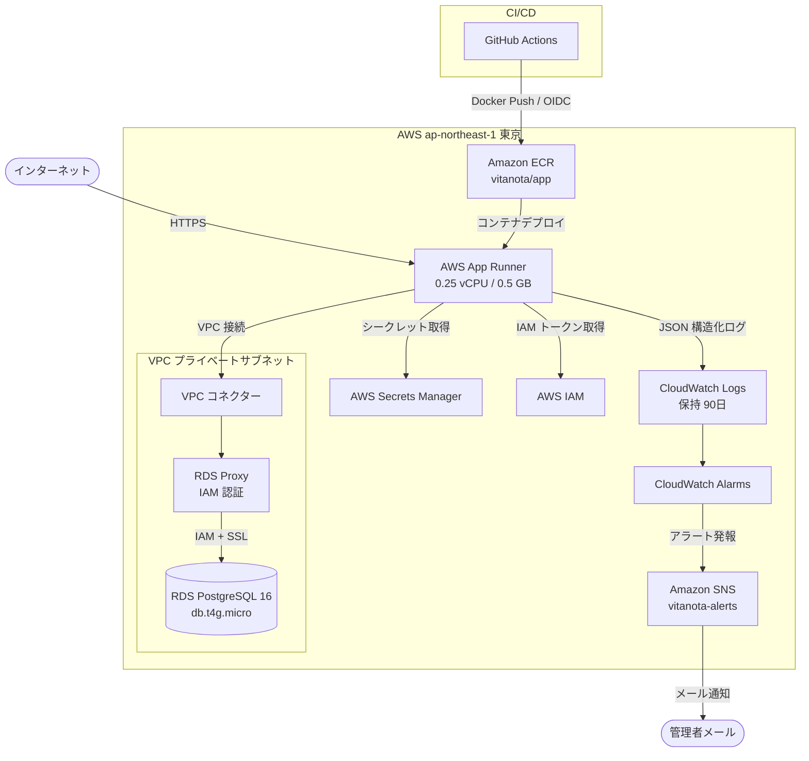

# Unit-01 インフラ設計

## 概要

Unit-01（認証・テナント基盤）のインフラ設計。論理コンポーネントを AWS サービスにマッピングし、dev / prod 2環境の構成を定義する。

---

## コンポーネント → AWSサービス マッピング

| 論理コンポーネント | AWSサービス | 環境 |
|---|---|---|
| Logger | Amazon CloudWatch Logs | dev / prod |
| SecretsLoader | AWS Secrets Manager | dev / prod |
| DbAuthProvider | AWS IAM（RDS Proxy IAM 認証） | dev / prod |
| DbClient | Amazon RDS Proxy → RDS PostgreSQL 16 | dev / prod |
| RateLimiter | App Runner コンテナ内メモリ | dev / prod |
| HealthCheck | App Runner ヘルスチェック（/api/health） | dev / prod |
| Next.js アプリ全体 | AWS App Runner | dev / prod |

---

## コンピューティング：AWS App Runner

### インスタンス構成

| 項目 | dev | prod |
|---|---|---|
| vCPU | 0.25 | 0.25 |
| メモリ | 0.5 GB | 0.5 GB |
| 最小インスタンス数 | 0（リクエストベース） | 1（常時起動） |
| 最大インスタンス数 | 3 | 5 |
| ヘルスチェックパス | /api/health | /api/health |
| ヘルスチェック間隔 | 10 秒 | 10 秒 |

**注記（メモリリスク）**: 0.5 GB は Next.js の実行に対してタイトである（Next.js 起動時に約 300〜400 MB 消費）。デプロイ後は CloudWatch Metrics の`MemoryUtilization`を監視し、OOM（メモリ不足終了）が発生した場合は 0.5 vCPU / 1 GB に即時スケールアップすること。

### VPC コネクター

App Runner はパブリックネットワークで動作するが、VPC コネクターを介してプライベートサブネット内の RDS Proxy に接続する。

```
App Runner（パブリック）
        |
  VPC コネクター（apprunner-vpc-connector）
        |
  VPC プライベートサブネット
        |
  RDS Proxy → RDS PostgreSQL
```

### コンテナレジストリ

- **サービス**: Amazon ECR（Elastic Container Registry）
- **リポジトリ名**: `vitanota/app`
- **イメージタグ戦略**: `{env}-{git-sha}`（例: `prod-a1b2c3d`）
- **ライフサイクルポリシー**: 30世代を超えた古いイメージを自動削除

---

## ストレージ：Amazon RDS PostgreSQL 16

### インスタンス構成

| 項目 | dev | prod |
|---|---|---|
| インスタンスタイプ | db.t4g.micro | db.t4g.micro |
| Multi-AZ | なし（単一AZ） | あり |
| ストレージ | 20 GB gp3 | 20 GB gp3（自動スケーリング有効） |
| PostgreSQL バージョン | 16 | 16 |
| 自動バックアップ保持期間 | 7日 | 7日 |
| メンテナンスウィンドウ | 日曜 04:00〜05:00 JST | 日曜 04:00〜05:00 JST |
| 削除保護 | 無効 | 有効 |

**注記（CPU クレジット）**: db.t4g.micro は CPU クレジット制（バースト型）である。短時間のスパイクには対応できるが、継続的な高負荷（例: バッチ処理）で CPU クレジットが枯渇するリスクがある。CloudWatch の`CPUCreditBalance`アラームで監視し、クレジット低下時には `db.t4g.small` へのスケールアップを検討すること。

### サブネット・セキュリティ

- **サブネット**: VPC 内プライベートサブネット 2 AZ（Multi-AZ 対応）
- **パブリックアクセス**: 無効（完全プライベート）
- **暗号化**: AWS KMS で保管時暗号化（デフォルトキー）
- **TLS**: 転送時暗号化（`ssl: require`）

---

## 接続プール：Amazon RDS Proxy

| 項目 | 設定値 |
|---|---|
| 認証方式 | IAM 認証（パスワードレス） |
| 接続プールサイズ | RDS インスタンス最大接続数の 50%（約 25 接続） |
| アイドルタイムアウト | 30分 |
| VPC | RDS と同一プライベートサブネット |
| TLS | 必須 |

---

## セキュリティグループ設計

### sg-app-runner

| 方向 | プロトコル | ポート | 送信元/宛先 | 説明 |
|---|---|---|---|---|
| Outbound | TCP | 5432 | sg-rds-proxy | RDS Proxy への接続 |
| Outbound | TCP | 443 | 0.0.0.0/0 | Secrets Manager / IAM エンドポイント |

### sg-rds-proxy

| 方向 | プロトコル | ポート | 送信元/宛先 | 説明 |
|---|---|---|---|---|
| Inbound | TCP | 5432 | sg-app-runner | App Runner からの接続のみ許可 |
| Outbound | TCP | 5432 | sg-rds | RDS への接続 |

### sg-rds

| 方向 | プロトコル | ポート | 送信元/宛先 | 説明 |
|---|---|---|---|---|
| Inbound | TCP | 5432 | sg-rds-proxy | RDS Proxy からの接続のみ許可 |

---

## IAM 設計

### App Runner インスタンスロール（vitanota-apprunner-role）

```
iam:PassRole
secretsmanager:GetSecretValue        — 対象: arn:aws:secretsmanager:ap-northeast-1:*:secret:vitanota/*
rds-db:connect                        — 対象: arn:aws:rds-db:ap-northeast-1:*:dbuser:*/vitanota_app
logs:CreateLogGroup
logs:CreateLogStream
logs:PutLogEvents
ecr:GetAuthorizationToken
ecr:BatchCheckLayerAvailability
ecr:GetDownloadUrlForLayer
ecr:BatchGetImage
```

### GitHub Actions OIDC ロール（vitanota-github-actions-role）

GitHub Actions の OIDC プロバイダーを使用し、長期的な AWS クレデンシャルを不要にする。

```
ecr:GetAuthorizationToken
ecr:BatchCheckLayerAvailability
ecr:PutImage
ecr:InitiateLayerUpload
ecr:UploadLayerPart
ecr:CompleteLayerUpload
apprunner:UpdateService
apprunner:DescribeService
```

**信頼ポリシー条件**:
```json
{
  "StringLike": {
    "token.actions.githubusercontent.com:sub": "repo:your-org/vitanota:*"
  }
}
```

---

## シークレット管理

### Secrets Manager リソース

| シークレット名 | 内容 | ローテーション |
|---|---|---|
| `vitanota/nextauth-secret` | NextAuth JWT 署名キー（256bit ランダム文字列） | 手動（必要時） |
| `vitanota/google-client-id` | Google OAuth クライアント ID | 手動 |
| `vitanota/google-client-secret` | Google OAuth クライアントシークレット | 手動 |

**注記**: DB 接続情報（RDS Proxy エンドポイント・ユーザー名・DB 名）は Secrets Manager ではなく App Runner の環境変数として設定する（IAM 認証のためパスワードは不要）。

---

## 監視・ログ

### CloudWatch Logs

| ロググループ | 保持期間 | 用途 |
|---|---|---|
| `/vitanota/prod/app` | 90日 | 本番アプリログ（pino JSON） |
| `/vitanota/dev/app` | 30日 | 開発アプリログ |

### CloudWatch アラーム + SNS

**SNS トピック**: `vitanota-alerts`（Email サブスクリプション）

| アラーム名 | メトリクス | 閾値 | 評価期間 |
|---|---|---|---|
| AuthErrors | ログフィルター（event:auth_error） | 20回/5分 | 1回 |
| AppErrors | ログフィルター（level:error） | 10回/5分 | 1回 |
| RdsCpuHigh | RDS CPUUtilization | 80% 超過 | 2回連続（10分） |
| RdsCreditLow | RDS CPUCreditBalance | 50 未満 | 2回連続（10分） |
| Http5xx | App Runner 5xx レスポンス | 5回/1分 | 1回 |
| MemoryHigh | App Runner MemoryUtilization | 80% 超過 | 2回連続（10分） |

---

## インフラ構成図



---

## 環境変数（App Runner 設定）

### 通常の環境変数（非シークレット）

| 変数名 | dev | prod |
|---|---|---|
| `NODE_ENV` | `development` | `production` |
| `AWS_REGION` | `ap-northeast-1` | `ap-northeast-1` |
| `RDS_PROXY_ENDPOINT` | dev RDS Proxy エンドポイント | prod RDS Proxy エンドポイント |
| `DB_USER` | `vitanota_dev` | `vitanota_app` |
| `DB_NAME` | `vitanota_dev` | `vitanota` |
| `NEXTAUTH_URL` | `https://dev.vitanota.example.com` | `https://vitanota.example.com` |

### シークレット参照（App Runner シークレット設定）

| 環境変数名 | Secrets Manager ARN |
|---|---|
| `NEXTAUTH_SECRET` | `arn:aws:secretsmanager:ap-northeast-1:...:secret:vitanota/nextauth-secret` |
| `GOOGLE_CLIENT_ID` | `arn:aws:secretsmanager:ap-northeast-1:...:secret:vitanota/google-client-id` |
| `GOOGLE_CLIENT_SECRET` | `arn:aws:secretsmanager:ap-northeast-1:...:secret:vitanota/google-client-secret` |
