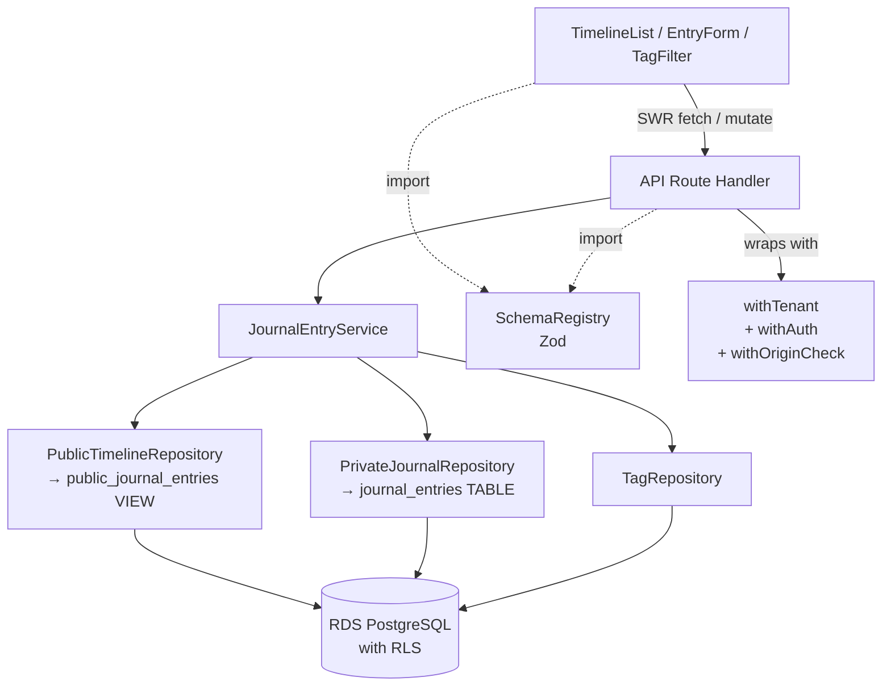

# Unit-02 論理コンポーネント

## 概要

Unit-02（日誌・感情記録コア）で追加・拡張する論理コンポーネント。Unit-01 の基盤コンポーネント（Logger・SecretsLoader・DbClient・AuthProvider・withTenant 等）はそのまま利用する。

---

## Unit-01 から継承するコンポーネント

| コンポーネント | 提供機能 | Unit-02 での利用 |
|---|---|---|
| Logger | pino + redact 構造化ログ | 日誌イベントログ出力 |
| SecretsLoader | Secrets Manager 取得＋インメモリキャッシュ | そのまま |
| DbClient | Drizzle ORM + RDS Proxy + IAM認証 | そのまま |
| withTenant | RLS セッション変数注入ミドルウェア | 全 Unit-02 API で使用・R1対策強化 |
| withAuth | Auth.js セッション検証 | 全 Unit-02 API で使用 |
| withOriginCheck | CloudFront 署名ヘッダー検証 | そのまま |
| SchemaRegistry | Zod スキーマ共有 | `lib/schemas/journal.ts` を追加 |

---

## Unit-02 で追加する論理コンポーネント

### LC-U02-01a: PublicTimelineRepository

**責務**: **共有タイムラインの読み取り専用**。`is_public=true` エントリのみを扱う。SP-U02-04 多層防御の Layer 3。

**配置**: `lib/repositories/publicTimelineRepository.ts`

**インターフェース**:
```ts
interface PublicTimelineRepository {
  findTimeline(tx: Tx, opts: TimelineOptions, ctx: Context): Promise<PublicJournalEntry[]>
  // 他のメソッドは意図的に存在しない
}
```

**特性**:
- PostgreSQL View `public_journal_entries` のみを SELECT 対象とする
- 型は `PublicJournalEntry`（型ブランド付き、`JournalEntry` と非互換）
- `create` / `update` / `delete` / `findById` / `findMine` は**存在しない**（物理的に書き込み・非公開取得不可）
- レスポンスに `is_public` 列が含まれない（View で除外）

---

### LC-U02-01b: PrivateJournalRepository

**責務**: 日誌エントリの CRUD（作成・更新・削除・マイ記録取得・詳細取得）。所有者のみがアクセス可能な操作を扱う。

**配置**: `lib/repositories/privateJournalRepository.ts`

**インターフェース**:
```ts
interface PrivateJournalRepository {
  create(tx: Tx, input: CreateEntryInput, ctx: Context): Promise<JournalEntry>
  update(tx: Tx, id: string, input: UpdateEntryInput, ctx: Context): Promise<JournalEntry | null>
  delete(tx: Tx, id: string, ctx: Context): Promise<boolean>
  findById(tx: Tx, id: string, ctx: Context): Promise<JournalEntry | null>
  findMine(tx: Tx, opts: PaginationOptions, ctx: Context): Promise<JournalEntry[]>
  // findTimeline は意図的に存在しない
}
```

**依存**:
- DbClient（Drizzle）
- TagRepository（タグ関連 INSERT・感情タグ/業務タグの両方を扱う）
- Logger（イベントログ）

**特性**:
- 全メソッドが `Tx`（トランザクション）を第1引数に受け取る（R1 対策）
- `ctx: { userId, tenantId }` で明示的にコンテキストを渡す（API 層でのチェック容易化）
- 返却値が `null` の場合は呼び出し側で 404 マッピング
- 所有者チェックは API 層 + RLS の二重防御（SP-U02-03）

---

### LC-U02-02: TagRepository

**責務**: タグの CRUD・システムデフォルトタグのシード・テナント内タグ一覧取得

**配置**: `lib/repositories/tagRepository.ts`

**インターフェース**:
```ts
interface TagRepository {
  create(tx: Tx, input: CreateTagInput, ctx: Context): Promise<Tag>
  delete(tx: Tx, id: string, ctx: Context): Promise<{ affectedEntries: number }>
  findAllByTenant(tx: Tx, ctx: Context): Promise<Tag[]>
  seedSystemDefaults(tx: Tx, tenantId: string): Promise<Tag[]>
}
```

**特性**:
- `seedSystemDefaults` はテナント作成トランザクション内で呼び出される（Unit-01 の TenantService から呼ばれる想定）
- `delete` は CASCADE で紐づき削除、影響エントリ数を返却
- `school_admin` 権限チェックは API 層で実施（Repository は権限を知らない）

---

### LC-U02-03: JournalEntryService（ビジネスロジック層）

**責務**: 複数 Repository を跨ぐビジネスロジックを集約する。

**配置**: `lib/services/journalEntryService.ts`

**主なメソッド**:
```ts
interface JournalEntryService {
  createEntry(input: CreateEntryInput, ctx: Context): Promise<JournalEntry>
  // 内部で JournalEntryRepository.create + TagRepository.findByIds（検証）を呼ぶ

  updateEntry(id: string, input: UpdateEntryInput, ctx: Context): Promise<JournalEntry>
  // 所有者検証 + Repository.update

  deleteEntry(id: string, ctx: Context): Promise<void>
  // 所有者検証 + CASCADE 削除
}
```

**特性**:
- API 層から直接呼ばれるエントリポイント
- 内部で `withTenant` を使って transaction を張る
- 例外を投げ、API 層で HTTP ステータスにマッピング

---

### LC-U02-04: SchemaRegistry（Zod スキーマ）

**配置**: `lib/schemas/`

**ファイル構成**:
```
lib/schemas/
  journal.ts       — createEntrySchema, updateEntrySchema
  tag.ts           — createTagSchema, deleteTagSchema
  timeline.ts      — timelineQuerySchema（ページネーション）
```

**SP-U02-01 準拠**:
- クライアント（React Hook Form zodResolver）と API 層（`schema.parse`）から import
- `z.infer<typeof schema>` で型を派生
- DB CHECK 制約は追加しない

---

### LC-U02-05: TagFilter（クライアントコンポーネント）

**配置**: `components/journal/TagFilter.tsx`

**責務**: PP-U02-01 パターンの実装。タグ一覧表示と部分一致フィルタリング。

**入出力**:
- 入力: `tags: Tag[]`（SWR で取得済み全タグ）
- 出力: `selectedTagIds: string[]`（親フォームに渡す）
- 内部状態: `query: string`（フィルタ入力）

**非機能要件**:
- 初期表示 100ms 以内（NFR-U02-01）
- 入力レスポンス: 16ms 以内（60fps）

---

### LC-U02-06: TimelineList（クライアントコンポーネント）

**配置**: `components/journal/TimelineList.tsx`

**責務**: 共有タイムライン表示（SWR によるデータ取得・mutate による無効化）

**データフロー**:
```
useSWR('/api/journal/entries', fetcher, {
  revalidateOnFocus: true,   // タブ復帰時に再検証
  dedupingInterval: 5000,    // 5秒以内の重複リクエスト排除
})
     ↓
[TimelineList]
     ↓
[EntryCard × 20]
```

**エントリ投稿後のフロー**:
```
EntryForm submit
  → POST /api/journal/entries
  → onSuccess: mutate('/api/journal/entries')
  → SWR が再フェッチ
```

---

## コンポーネント間の依存関係



---

## 外部サービス依存の整理

| サービス | 用途 | 継承元 |
|---|---|---|
| RDS PostgreSQL 16 | 日誌・タグ・感情カテゴリの永続化 | Unit-01 |
| RDS Proxy | 接続プール・IAM認証 | Unit-01 |
| CloudFront | 共有タイムラインのエッジキャッシュ | Unit-01（Unit-02 NFR対応で遡及追加） |
| AWS WAF v2 | エッジ層の攻撃遮断 | Unit-01（遡及追加） |
| Secrets Manager | DB 認証・署名ヘッダー値 | Unit-01 |
| CloudWatch Logs | 構造化ログ・WAF ログ | Unit-01 |
| Auth.js | セッション管理 | Unit-01 |

**Unit-02 で新規に追加する外部サービス**: **なし**

---

## データストア変更（Unit-02 追加スキーマ）

既存スキーマへの追加のみ。詳細は Unit-02 の機能設計 `domain-entities.md` を参照。

| テーブル/ビュー | 種別 | RLS |
|---|---|---|
| `journal_entries` | 新規（TABLE） | 2ポリシー（public_read + owner_all）|
| `public_journal_entries` | 新規（VIEW） | `WHERE is_public = true` を定義に内包、`is_public` 列を返さない。SP-U02-04 Layer 4 |
| `tags` | 新規（`is_emotion` フラグで感情/業務を統合） | テナント内読み取り可 |
| `journal_entry_tags` | 新規（中間） | journal_entries 経由 |

マイグレーションは R7（ローリングデプロイ競合）対策として後方互換性を保ちながら段階的に適用する。
