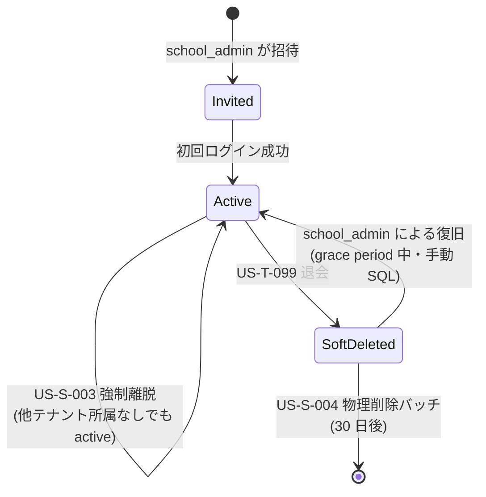
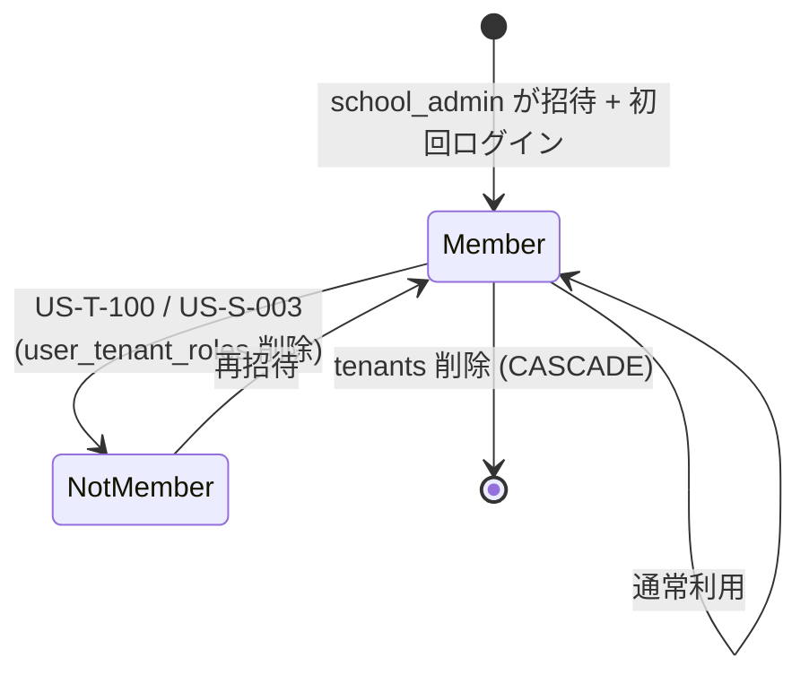

# vitanota ユーザーライフサイクル仕様

**作成日**: 2026-04-15
**最終更新**: 2026-04-15（Phase 1 完了時点）
**スコープ**: Unit-01（認証基盤）+ Unit-02（journal）に跨る横断仕様
**ステータス**: Phase 1 完了（スキーマ修正 + ストーリー追加）/ Phase 2 未着手（API・Service・バッチ）
**関連論点**: `security-review.md` 論点 M

## 単一真実源について

このファイルは vitanota における「ユーザーの退会・転勤・データエクスポート」の業務仕様の単一真実源である。
受け入れ基準は `stories.md`、動作フローは `sequence-diagrams.md`、データ構造は `er-diagram.md` を参照するが、
**設計判断・ビジネスルール・データ帰属原則・API 契約**はこのファイルに集約する。

---

## 1. 概要とスコープ

vitanota における教員ユーザーは以下のライフサイクルを持つ：

```
[アカウント未作成]
       │ school_admin による招待
       ▼
[active]                      ← 通常運用
       │
       ├─ 転勤 (US-T-100)        → [active]（テナント所属が変わる）
       │
       ├─ 退会 (US-T-099)        → [soft_deleted]
       │                              │ 30日 grace
       │                              ▼
       │                          [hard_deleted]（行が物理削除）
       │
       └─ 強制離脱 (US-S-003)    → 学校から外れる（人格は active のまま）
              │                       │
              │ 他テナント所属あり    │ 他テナント所属なし
              ▼                       ▼
          [active]                   [active]（属するテナント 0）
                                     ※自動で soft_deleted にはならない
```

**スコープに含めるユースケース**:
- US-T-098: マイ記録エクスポート（在籍中いつでも）
- US-T-099: vitanota 退会（本人操作）
- US-T-100: 学校から離脱（転勤・本人 or admin）
- US-S-003: school_admin が教員を学校から外す（退職処理）
- US-S-004: 物理削除バッチ（30日後）

**スコープ外**:
- 兼務（複数テナント所属）の管理 UI → Unit-04
- データインポート（他システムからの移行） → 将来計画
- アカウント停止（凍結）→ テナント停止で代替

---

## 2. データ帰属の原則

これがこの仕様の核心。各データの「所有者」と「離脱時の扱い」を明示する。

| データ | 帰属 | 転勤時 | 退会時 |
|---|---|---|---|
| `users`（人格） | グローバル | 維持 | soft delete → 30日後 hard delete |
| `accounts`（OAuth 連携） | グローバル | 維持 | 即時 DELETE |
| `sessions`（ログイン状態） | ユーザー単位 | 維持 | 即時 DELETE |
| `user_tenant_roles` | テナント × ユーザー | 旧テナントの行を DELETE | 全行 DELETE |
| **公開 `journal_entries`** | **テナント（学校）** | **本人名を匿名化（user_id=NULL）** | **匿名化保持 or 削除（本人選択）** |
| **非公開 `journal_entries`**（マイ記録） | **テナント × ユーザー** | **元学校に grace 中残存 → 削除** | **grace 中残存 → 削除** |
| `tags`（タグ本体） | テナント | 残る | 残る |
| `tags.created_by` | 参照のみ | 維持 | SET NULL（匿名化） |
| `journal_entry_tags` | journal_entries 経由 | journal_entries の操作で連動 | 同左 |
| `invitation_tokens.invited_by` | 監査用 | 維持 | SET NULL |

**業務ルールの言葉での表現**:

> 共有タイムラインは「**学校の集合的な振り返りの記録**」として、教員個人の所有物ではなく**学校に帰属**する。
> 一度公開した投稿は、転勤・退会後も学校に残る（匿名化はされる）。

> マイ記録は「**個人の内省日記**」として**教員個人に帰属**する。
> 転勤・退会前にエクスポート（US-T-098）して持ち出すことができる。
> 持ち出さなかった場合、grace period（30日）後に物理削除される。

---

## 3. 設計判断（2026-04-15 確定）

| Q | 論点 | 採用 | 理由 |
|---|---|---|---|
| Q1 | 転勤時の公開エントリの本人名 | **B: 匿名化** | 学校に帰属するが個人特定情報は除去 |
| Q2 | 転勤時のマイ記録の扱い | **A: grace 中残存・その後削除** | エクスポート漏れの救済期間 |
| Q3 | エクスポート形式 | **B: JSON + Markdown** | 機械可読 + 人間可読の両立 |
| Q4 | Phase 1 のスコープ | **C: スキーマ + stories のみ** | API 実装は次 Unit と統合 |

---

## 4. ドメイン状態遷移

### User の状態



**重要**: `user_tenant_roles` が空でも `users.deleted_at IS NULL` なら `Active` 状態。
これは「兼務復帰の可能性を残す」「学校間の異動準備期間」を許容するため。

### User × Tenant の関係



---

## 5. ビジネスプロセス（BP-USER-LIFECYCLE-*）

### BP-USER-01: マイ記録エクスポート（US-T-098）

```
入力: format ('json' | 'markdown')
前提: 認証済みユーザー、ctx { userId, tenantId }
       deletedAt IS NULL
       user_tenant_roles に該当 tenant の所属あり

処理:
  1. withTenantUser でトランザクション開始
  2. SELECT journal_entries WHERE user_id = ctx.userId AND tenant_id = ctx.tenantId
     (RLS owner_all により自分の全エントリ・公開非公開両方)
  3. SELECT 紐づき tags（LEFT JOIN journal_entry_tags + tags）
  4. format に応じて JSON / Markdown に整形
  5. logEvent(UserExported, { userId, tenantId, count, format })
  6. Content-Type と Content-Disposition ヘッダーで attachment 返却

出力: ファイルダウンロード
  - JSON: { exportedAt, user, entries: [{ id, content, isPublic, createdAt, updatedAt, tags: [{name, isEmotion}] }] }
  - Markdown: # マイ記録 vitanota / [日付] [タグ] / 本文 / ---
```

---

### BP-USER-02: 学校から離脱（US-T-100、本人 or admin）

```
入力: tenantId（離脱対象のテナント）
前提: ctx.userId が tenantId に user_tenant_roles で所属
       admin の場合: ctx.roles.includes('school_admin') AND ctx.tenantId == tenantId

処理:
  1. db.transaction で開始
  2. DELETE FROM user_tenant_roles
       WHERE user_id = targetUserId AND tenant_id = tenantId
  3. UPDATE journal_entries SET user_id = NULL
       WHERE user_id = targetUserId AND tenant_id = tenantId AND is_public = true
     (Q1=B: 公開エントリを匿名化)
  4. DELETE FROM sessions
       WHERE user_id = targetUserId AND active_tenant_id = tenantId
     (該当テナントのセッションのみ無効化)
  5. logEvent(UserTransferredFromTenant, { userId: targetUserId, tenantId, by: ctx.userId })
  6. COMMIT

事後:
  - 該当テナントの非公開 journal_entries は残存（grace period 開始）
  - users.deleted_at は触らない（兼務継続の可能性）
  - 他テナント所属があればそちらは生き残る
  - Phase 2 の物理削除バッチが grace 後に該当マイ記録を削除

出力: 200 OK (admin 経由) or 302 (本人経由)
```

---

### BP-USER-03: vitanota 退会（US-T-099、本人）

```
入力: { reason?, anonymizePublic: boolean }
前提: 認証済み本人

処理:
  1. db.transaction で開始
  2. UPDATE users SET deleted_at = NOW() WHERE id = ctx.userId
  3. DELETE FROM accounts WHERE user_id = ctx.userId
     (OAuth 連携を即時遮断、再ログイン経路を消す)
  4. DELETE FROM sessions WHERE user_id = ctx.userId
     (全セッション即時失効)
  5. DELETE FROM user_tenant_roles WHERE user_id = ctx.userId
     (全テナント所属を解除)
  6. 公開エントリの処理（anonymizePublic フラグで分岐）:
       if anonymizePublic == true:
         UPDATE journal_entries SET user_id = NULL
           WHERE user_id = ctx.userId AND is_public = true
       else (削除請求):
         DELETE FROM journal_entries
           WHERE user_id = ctx.userId AND is_public = true
  7. (マイ記録 = is_public=false は触らない、grace period で残す)
  8. logEvent(UserSoftDeleted, { userId, reason, anonymizePublic })
  9. COMMIT

事後:
  - users.deleted_at がセットされる (grace 開始)
  - Phase 2 で session callback が deletedAt を確認して 401 を返すようになる
  - 30 日後に物理削除バッチが残存マイ記録 + users 行を削除

出力: 200 OK + Set-Cookie で Cookie クリア
```

---

### BP-USER-04: school_admin による教員強制離脱（US-S-003）

```
入力: targetUserId
前提: ctx.roles.includes('school_admin')
       targetUser が ctx.tenantId に所属している

処理:
  1. BP-USER-02 と同じ手順を targetUserId に対して実行
  2. 違いは「by: ctx.userId」を監査ログに記録
  3. 公開エントリは Q1=B により強制的に匿名化
     (本人意思の代行はしない = 削除オプションは admin には提供しない)

出力: 200 OK + 監査ログ
```

---

### BP-USER-05: 物理削除バッチ（US-S-004、30 日後）

```
入力: なし（EventBridge Scheduler から日次トリガー）
前提: Lambda 実行ロール

処理:
  1. SELECT id FROM users
     WHERE deleted_at IS NOT NULL
       AND deleted_at < NOW() - INTERVAL '30 days'
  2. 各 user について:
       DELETE FROM users WHERE id = ?
       (CASCADE で連動削除:
        - 残存マイ記録
        - journal_entry_tags
        - tags.created_by は SET NULL なので残る
        - invitation_tokens.invited_by は SET NULL なので残る
        - 公開エントリは既に user_id=NULL になっているので影響なし)
  3. logEvent(UserHardDeleted, { userId, deletedAt, gracePeriodDays: 30 })

出力: 削除件数（メトリクスとして CloudWatch に記録）
```

---

## 6. ビジネスルール（BR-USER-LIFECYCLE-*）

### BR-USER-LIFECYCLE-01: 自動 soft delete の禁止

`user_tenant_roles` が空になった瞬間に `users.deleted_at` を自動セットしてはならない。
**理由**: 兼務復帰・短期間の異動準備期間・新規招待待ちの状態を許容するため。

### BR-USER-LIFECYCLE-02: 公開エントリの匿名化選択肢

退会時の公開エントリ削除（`anonymizePublic=false`）は**本人のみが選択可能**。
school_admin による強制離脱では選択肢を提供せず、常に匿名化保持とする。
**理由**: 個人情報保護法の削除請求権は本人の意思表示が必要。学校側が代行できない。

### BR-USER-LIFECYCLE-03: grace period の長さ

soft delete 後の grace period は **30 日**固定。
**理由**: 個人情報保護法・文科省ガイドラインの「速やかな削除」要件と「誤操作からの復旧可能性」のバランス。
将来必要なら設定化するが、Phase 2 ではハードコーディング。

### BR-USER-LIFECYCLE-04: grace 中の認証扱い

Phase 2 の session callback は以下を実装する：
- `users.deleted_at IS NOT NULL` → 401 を返す
- 復旧したい場合は school_admin が手動 SQL で `deleted_at = NULL` にリセット
- ブラウザ側の Cookie はサーバー側 sessions テーブルから既に消えているため再ログインが必要

### BR-USER-LIFECYCLE-05: マイ記録の grace 中の扱い

`user_id IS NOT NULL AND deleted_at IS NOT NULL` の所有者を持つ非公開エントリは、
**grace period 中は誰からも参照不可**（API 経由ではアクセスできない）。
ただし物理削除バッチが走るまで DB には残る。
**理由**: 復旧時にマイ記録も復活させる必要があるため。

### BR-USER-LIFECYCLE-06: エクスポートのレート制限

`POST /api/me/export` はユーザーあたり **5回/時間**のレート制限を設ける（Unit-01 の rate-limit を流用）。
**理由**: 過剰実行による DB 負荷を防ぐ。

### BR-USER-LIFECYCLE-07: 監査ログの永続性

退会・転勤・エクスポートのイベントログは、**ユーザー本体が物理削除された後も S3 監査ログに残る**（論点 D の 7 年保持）。
削除されるのは個人特定情報（content）のみで、操作の事実は監査要件のため保持される。

### BR-USER-LIFECYCLE-08: 強制離脱時のテナント外観

教員 X が学校 A から強制離脱された後、学校 A の school_admin が教員 X の名前を一覧で見られなくなる。
ただし監査ログには userId が残るため、別途検索可能。

### BR-USER-LIFECYCLE-09: 公開エントリ削除の影響範囲

退会時に `anonymizePublic=false` を選択した場合、削除されるのは**本人が公開した journal_entries** のみ。
他人が引用・参照していた場合の整合性は対応しない（vitanota にはコメント機能等の引用関係がないため問題なし）。

### BR-USER-LIFECYCLE-10: tenant 削除との関係

`tenants` を DELETE すると CASCADE で関連データが全削除される（既存）。
ユーザー本体は users.tenant_id が無いため影響を受けない。
ただし user_tenant_roles 経由で該当テナントの所属だけが消える。
結果として、テナント停止後も users 行は残るので、他テナントで継続利用可能。

---

## 7. Phase 2 API 契約ドラフト

実装前のラフな型定義。Phase 2 着手時に Zod スキーマとして実装する。

### POST /api/me/export

**Auth**: 認証必須・本人のみ
**Cache-Control**: `private, no-store`
**Rate Limit**: 5/h per user (BR-USER-LIFECYCLE-06)

```ts
// Request
const exportQuerySchema = z.object({
  format: z.enum(['json', 'markdown']).default('json'),
});

// Response (JSON)
{
  exportedAt: string;        // ISO 8601
  exportedBy: { userId: string; email: string; name: string };
  tenant: { id: string; name: string };
  entries: Array<{
    id: string;
    content: string;
    isPublic: boolean;
    createdAt: string;
    updatedAt: string;
    tags: Array<{ name: string; isEmotion: boolean }>;
  }>;
}

// Response (Markdown)
// Content-Type: text/markdown
// 形式:
// # vitanota マイ記録 (テナント: 学校A)
// **エクスポート日**: 2026-04-15
//
// ## 2026-04-15 10:30  [うれしい] [授業準備]
// 今日の授業の振り返り...
//
// ---
```

**ログ**: `LogEvents.UserExported`

---

### POST /api/me/withdraw

**Auth**: 認証必須・本人のみ

```ts
const withdrawSchema = z.object({
  reason: z.string().max(500).optional(),
  anonymizePublic: z.boolean(),  // BR-USER-LIFECYCLE-02
});

// Response 200
// + Set-Cookie: next-auth.session-token=; expires=過去
{
  success: true;
  deletedAt: string;
  gracePeriodEndsAt: string;  // 30 日後
}
```

**ログ**: `LogEvents.UserSoftDeleted`

---

### POST /api/admin/users/[id]/remove-from-tenant

**Auth**: 認証必須・school_admin のみ
**Path Param**: 対象ユーザー ID
**Body**: `{ reason: string }`（必須・退職理由など）

```ts
// Response 200
{
  success: true;
  removedFromTenantId: string;
  anonymizedPublicEntriesCount: number;
}
```

**ログ**: `LogEvents.UserTransferredFromTenant`

---

### 内部: 物理削除バッチ Lambda

**Auth**: Lambda 実行ロール（IAM）
**入力**: なし（EventBridge Scheduler から日次トリガー）

```ts
// 擬似コード
async function handler() {
  const targets = await db.select({ id: users.id })
    .from(users)
    .where(and(
      isNotNull(users.deletedAt),
      lt(users.deletedAt, sql`NOW() - INTERVAL '30 days'`)
    ));

  for (const { id } of targets) {
    await db.delete(users).where(eq(users.id, id));
    logEvent(LogEvents.UserHardDeleted, { userId: id, gracePeriodDays: 30 });
  }

  return { deletedCount: targets.length };
}
```

---

## 8. データ削除の優先順位

退会時の実行順は重要：

```
1. UPDATE users SET deleted_at = NOW()       ← 真っ先にフラグを立てる
2. DELETE accounts                            ← 再ログインを即座に防ぐ
3. DELETE sessions                            ← 進行中のセッションを切る
4. DELETE user_tenant_roles                   ← 権限を剥奪
5. UPDATE/DELETE journal_entries (公開)       ← 匿名化 or 削除
6. (マイ記録は触らない・grace で残す)
7. COMMIT
8. ログ出力
9. レスポンス返却 (Cookie クリア)
```

**理由**:
- 1 を最初にすることで、もし途中で失敗しても deletedAt は確実に立つ → 次の自動失効サイクルで処理される
- 2-3 を続けて行うことで、進行中の他リクエストが新しいデータを書き込めなくなる
- 4 で権限剥奪、5 で公開データ整理
- すべて同一トランザクションでアトミック実行

---

## 9. 法的要件マッピング

### 個人情報保護法（日本）

| 条文 | 要件 | 対応 |
|---|---|---|
| 第 17 条 | 利用目的の特定 | プライバシーポリシーで定義（運用フェーズで策定） |
| 第 18 条 | 利用目的の通知・公表 | 同上 |
| 第 19 条 | 適正取得 | OAuth + 招待制で本人同意必須 |
| 第 22 条 | データ正確性の確保・**削除** | **US-T-099 anonymizePublic=false で対応** |
| 第 23 条 | 安全管理措置 | RLS・SP-U02-04 8 層防御・暗号化 |
| 第 27 条 | 第三者提供の制限 | テナント内のみ共有・第三者提供なし |
| 第 33 条 | 開示請求 | **US-T-098 マイ記録エクスポートで対応** |
| 第 35 条 | **削除請求** | **US-T-099 で対応** |

### 文部科学省「教育情報セキュリティポリシーに関するガイドライン」

| 要件 | 対応 |
|---|---|
| 教育情報の最小化 | grace period 後の物理削除（US-S-004） |
| アクセス権限の管理 | school_admin による教員管理（US-S-003） |
| 退職者のアクセス遮断 | 強制離脱で即座に sessions 削除 |
| 監査証跡の保管 | S3 Object Lock 7 年（論点 D） |

### GDPR（参考・将来の海外展開時）

| 条文 | 要件 | 対応 |
|---|---|---|
| Art. 17 | 削除権（忘れられる権利） | US-T-099 anonymizePublic=false |
| Art. 20 | データポータビリティ権 | US-T-098（JSON 形式でエクスポート） |
| Art. 7 | 同意の撤回 | US-T-099 で実現 |

---

## 10. 関連ドキュメント

| ドキュメント | 含まれる内容 | 場所 |
|---|---|---|
| ユーザーストーリー | 受け入れ基準（本仕様の Oracle） | `aidlc-docs/inception/user-stories/stories.md` US-T-098/099/100, US-S-003/004 |
| シーケンス図 | 動作フロー（11-14） | `aidlc-docs/construction/sequence-diagrams.md` |
| ER 図 | データ構造・CASCADE | `aidlc-docs/construction/er-diagram.md` |
| セキュリティレビュー | 論点 M（設計判断・法的要件） | `aidlc-docs/inception/requirements/security-review.md` |
| 運用リスク | R13/14/15（API/バッチ未実装） | `aidlc-docs/construction/unit-02/nfr-design/operational-risks.md` |
| マイグレーション | スキーマ変更 SQL | `migrations/0006_user_lifecycle.sql` |
| Drizzle スキーマ | TypeScript 定義 | `src/db/schema.ts` |

---

## 11. 実装フェーズ

### Phase 1（完了・2026-04-15）

- [x] DB 制約の修正（FK SET NULL × 3）
- [x] `users.deleted_at` カラム追加
- [x] `journal_entries.user_id` を nullable に変更
- [x] schema.ts の更新
- [x] ストーリー追加（5 件）
- [x] ER 図・シーケンス図・security-review・operational-risks 更新
- [x] 本仕様書の作成
- [x] ユニットテスト（既存 142 件すべて GREEN を維持）

### Phase 2（次 Unit・admin 機能と統合）

- [ ] `POST /api/me/export` 実装（JSON + Markdown）
- [ ] `POST /api/me/withdraw` 実装
- [ ] `POST /api/admin/users/[id]/remove-from-tenant` 実装
- [ ] 認証層の `deletedAt` チェック（session callback）
- [ ] レート制限（BR-USER-LIFECYCLE-06）
- [ ] ログイベント追加: `UserExported` / `UserSoftDeleted` / `UserHardDeleted` / `UserTransferredFromTenant`
- [ ] 物理削除 Lambda 関数 + EventBridge Scheduler
- [ ] ユニットテスト（exportService・withdrawService）
- [ ] 統合テスト Suite 9（ユーザーライフサイクル）
- [ ] フロントエンド: `/me/export`・`/me/withdraw` ページ
- [ ] フロントエンド: school_admin 用「教員を学校から外す」UI

### Phase 3（運用フェーズ・将来）

- [ ] 復旧手順の Runbook 整備
- [ ] 30 日 grace の通知メール（grace 終了 7 日前にリマインド）
- [ ] 退会理由の集計・分析（プロダクト改善）
- [ ] エクスポート形式の追加（PDF・CSV など）

---

## 変更履歴

- **2026-04-15 初版**: 論点 M Phase 1 完了時点の仕様を整備。設計判断 Q1=B/Q2=A/Q3=B/Q4=C を反映。Phase 2 API ドラフトを記載。
