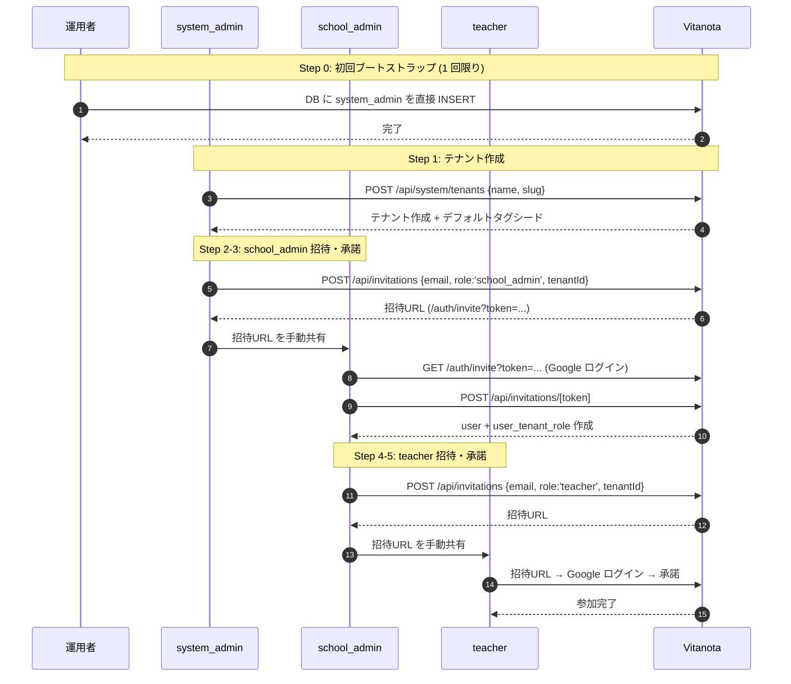

# ユーザーオンボーディング・招待フロー仕様

**バージョン**: 1.0 (MVP)
**最終更新**: 2026-04-21
**関連仕様**: `user-lifecycle-spec.md`（退会・転勤）、`auth-externalization.md`（Google 認証）

---

## 1. スコープ

MVP におけるユーザーのシステム参加フローを定める。初回ブートストラップから階層的な招待・承諾までを対象とする。退会・ロール変更は別仕様（`user-lifecycle-spec.md`）を参照。

## 2. 登場ロールと権限

| ロール | `tenant_id` | 主な権限 |
|---|---|---|
| `system_admin` | **NULL** | テナント作成・停止、任意テナントへの招待発行、全データ閲覧 |
| `school_admin` | 所属テナント | 自テナント内の `teacher`/`school_admin` 招待、管理ダッシュボード閲覧 |
| `teacher` | 所属テナント | 日誌機能、自分の entries の CRUD、公開 entries の閲覧 |
| `bootstrap` | (一時的) | セッション確立時のみ使用する読み取り専用ロール（内部実装） |

役割定義: `migrations/0001_unit01_initial.sql` の `chk_role` 制約、`migrations/0009_rls_role_separation.sql` の CASE 式を参照。

## 3. フロー概要



## 4. ステップ詳細

### Step 0: 初回ブートストラップ

**条件**: システム初回デプロイ直後、`user_tenant_roles` に `system_admin` が 0 件。

**手順**: 運用者が唯一の `system_admin` アカウントを手動で作成する。以下のいずれかで実施:
- **本番**: `db-migrator` Lambda の `bootstrap-admin` コマンドを invoke（payload で email/name を指定）
- **開発**: `migrations/` に seed SQL を追加 or ローカル psql で直接 INSERT

**作成レコード**:
```sql
INSERT INTO users (email, name, email_verified) VALUES ($email, $name, now());
INSERT INTO user_tenant_roles (user_id, tenant_id, role) VALUES ($user_id, NULL, 'system_admin');
```

**冪等性**: `users.email` の UNIQUE 制約と `user_tenant_roles` の NOT EXISTS チェックで再実行可能。

**頻度**: 本番環境につき 1 回きり。追加の `system_admin` が必要になった場合も同手順。

---

### Step 1: テナント作成（`system_admin` のみ）

**エンドポイント**: `POST /api/system/tenants`
**認可**: `session.user.roles.includes('system_admin')`

**入力**:
```json
{ "name": "○○小学校", "slug": "xx-elementary" }
```

**バリデーション**: slug は `^[a-z0-9-]+$`・3〜50 文字・UNIQUE

**副作用**: 同一トランザクション内で `tagRepo.seedSystemDefaults()` によりデフォルトタグが作成される（タグ 0 件の中間状態を防止）。

**出力**: `{ tenant: {...}, seededTagCount: N }` (201)

**関連ファイル**: `pages/api/system/tenants.ts`

---

### Step 2: 招待トークン発行

**エンドポイント**: `POST /api/invitations`
**認可**:
- `system_admin`: 任意テナントへの招待可
- `school_admin`: 自テナント(`session.user.tenantId`)のみ招待可

**入力**:
```json
{ "email": "teacher@example.com", "role": "teacher" | "school_admin", "tenantId": "<uuid>" }
```

**処理**:
1. 同一 `(tenantId, email)` の未使用トークンがあれば `usedAt = now()` で無効化（重複回避）
2. `crypto.randomBytes(48).base64url` でトークン生成
3. `invitation_tokens` に INSERT（`expiresAt = now() + 7日`）

**出力**:
```json
{ "invitation": { "id": "<uuid>", "expiresAt": "...", "inviteUrl": "https://vitanota.io/auth/invite?token=..." } }
```

**配達**: MVP では自動メール送信なし。呼び出し元が `inviteUrl` を手動で受信者に渡す。

**関連ファイル**: `pages/api/invitations/index.ts`

---

### Step 3: 招待トークン検証（GET）

**エンドポイント**: `GET /api/invitations/[token]`
**認可**: 認証不要（招待ページの表示前に使用）

**検証順序**:
1. トークンが存在するか → 404 `NOT_FOUND`
2. `usedAt IS NOT NULL` → 410 `INVITE_USED`
3. `expiresAt <= now()` → 410 `INVITE_EXPIRED`
4. 正常 → 200 `{ invitation: { email, role, expiresAt } }`

---

### Step 4: 招待承諾（POST）

**エンドポイント**: `POST /api/invitations/[token]`
**認可**: 認証済み（Google ログイン完了済み）

**セキュリティチェック**:
- `session.user.email === invitation.email` が必須 → 不一致は 403 `EMAIL_MISMATCH`（他人による流用防止）

**処理**:
1. 未使用・有効期限内のトークンを取得、なければ 410 `INVITE_INVALID`
2. `users` に該当 email が存在しなければ INSERT（初回招待経由サインアップ）
3. `user_tenant_roles` に `(userId, tenantId, role)` を INSERT（重複は `ON CONFLICT DO NOTHING`）
4. `invitation_tokens.usedAt = now()` で使用済みマーク

**出力**: 200 `{ success: true }`

**関連ファイル**: `pages/api/invitations/[token].ts`

---

## 5. セキュリティ制御

| 制御 | 仕組み | 仕様根拠 |
|---|---|---|
| 招待の他人使用防止 | Google ログインのメールと招待メール一致チェック | Step 4 の `EMAIL_MISMATCH` |
| トークン総当たり耐性 | 48 byte ランダム = 384 bit エントロピー | Step 2 `crypto.randomBytes(48)` |
| トークン使い回し防止 | `usedAt` のワンショット消費 | Step 4 の最終 UPDATE |
| 有効期限 | 発行から 7 日 | Step 2 `expiresAt` |
| 招待範囲のテナント分離 | `school_admin` は自テナントのみ招待可 | Step 2 の認可判定 |
| RLS によるデータ分離 | `app.tenant_id` / `app.user_id` / `app.role` の set_config + CASE 式 | `migrations/0009_rls_role_separation.sql` |
| 招待者削除時の履歴保持 | `invitation_tokens.invited_by` は `ON DELETE SET NULL` | `migrations/0006_user_lifecycle.sql` |

## 6. 運用上のルール

- **招待 URL の配達は運用者責任**: POST 応答の `inviteUrl` を安全なチャネル（組織内メール・チャット）で受信者に渡す
- **メール一致の事前合意**: 招待する前に、受信者が使用する Google アカウントのメールアドレスを確認する
- **有効期限切れの再発行**: 7 日を超えた場合は新規トークンを発行（旧トークンは自動失効）
- **重複招待**: 同一 `(tenantId, email)` への新規発行時は旧未使用トークンが自動無効化される
- **ロール剥奪は別フロー**: ロール変更・退会は `user-lifecycle-spec.md` 参照

## 7. Phase 2 以降で実装予定

| 項目 | 現状 | Phase 2 予定 |
|---|---|---|
| 招待メール自動送信 | 運用者が手動配達 | SES 等で自動送信 |
| 招待管理 UI (`/system/*`, `/admin/*`) | API のみ | React ページ実装 |
| 招待承諾ページ `/auth/invite` | 同上 | 専用ページ実装 |
| 一括招待 (CSV インポート) | 未対応 | 管理 UI から CSV アップロード |
| 招待失効の手動操作 | 未対応 | school_admin/system_admin が取り消し可能 |
| ロール変更 UI | 未対応 | `user-lifecycle-spec.md` の操作を UI 化 |

## 8. 関連ファイル

| 役割 | パス |
|---|---|
| ブートストラップ Lambda | `scripts/db-migrator/handler.ts` (`bootstrap-admin` コマンド) |
| テナント API | `pages/api/system/tenants.ts` |
| 招待発行 API | `pages/api/invitations/index.ts` |
| 招待承諾 API | `pages/api/invitations/[token].ts` |
| スキーマ定義 | `migrations/0001_unit01_initial.sql` (users / user_tenant_roles / invitation_tokens / tenants) |
| RLS ポリシー | `migrations/0009_rls_role_separation.sql` |
| 退会・転勤仕様 | `aidlc-docs/construction/user-lifecycle-spec.md` |
| 認証外部化仕様 | `aidlc-docs/construction/auth-externalization.md` |
