# 2026-05-11 AI 連携第一弾 — 実装プラン (Unit-05: AI 連携)

> **対応要件**: [`inception/requirements/2026-05-11-ai-chat-extraction.md`](../requirements/2026-05-11-ai-chat-extraction.md)
> **対応ストーリー**: [`inception/user-stories/2026-05-11-ai-chat-extraction-stories.md`](../user-stories/2026-05-11-ai-chat-extraction-stories.md)
> **想定工数**: 機能設計 + 実装 + テストで 2〜3 週間程度 (chimo の commit/push タイミング自主管理、memory)
> **作成日**: 2026-05-11
> **位置付け**: 既存 vitanota (本番稼働中) への新規 Unit-05 追加。既存 UX には一切影響しない設計

## 詳細分析サマリー

### 変革スコープ (ブラウンフィールド)
- **変革タイプ**: 既存システムへの **新規ユニット追加** (アーキテクチャ変革ではない)
- **主要変更**: Unit-05 (AI 連携) の新設、AWS Bedrock 統合、新規 API + UI
- **関連コンポーネント**: 既存 tasks / journal_entries テーブルへの非破壊カラム追加 (`source_chat_snippet`)

### 変更影響評価
- **User-facing changes**: Yes — 教員ダッシュボードにフローティングバブル追加、新規モーダル UX
- **Structural changes**: No — 既存アーキテクチャ (Next.js + AppRunner + RDS + CloudFront) は維持
- **Data model changes**: Minor — tasks / journal_entries にカラム 1 個ずつ追加 (NULL 許可、後方互換)
- **API changes**: 追加のみ — `/api/ai-chat/extract` 新規、既存 API は変更なし
- **NFR impact**: Yes — レイテンシ (p95 < 3 秒)、コスト管理 (50 回/日上限)、Bedrock 連携セキュリティ、観測性 (本人指標は管理者不可視)

### コンポーネント関係 (ブラウンフィールド)
- **Primary Component**: 新規 `src/features/ai-chat/` (Frontend) + 新規 Lambda (Backend)
- **Infrastructure Components**: `infra/lib/app-stack.ts` 拡張 (Bedrock IAM policy 追加)、新規 Lambda stack 検討
- **Shared Components**: 既存 `tasks` / `journal_entries` テーブル (カラム追加のみ)、既存 RLS 4 ロール体制 (流用)
- **Dependent Components**: なし (新規追加のため既存に依存はあるが、被依存はゼロ)
- **Supporting Components**: CloudWatch Logs (構造化ログ追加)、CloudWatch Metrics (新規メトリクス)、Secrets Manager (Bedrock 設定)

### リスク評価
- **Risk Level**: **Medium**
- **理由**:
  - 新規 AI 統合 (Bedrock 初導入) のプロンプト設計と精度検証が必要
  - モバイル UX の新規設計 (フローティング + インラインバブル)
  - mood 不可侵原則・観測者原則の厳密な実装が必要 (踏み絵)
  - ただし既存 UX には触らないので revert は容易 (リスク対称性)
- **Rollback Complexity**: **Easy** — 新規追加分を削除するだけ、既存タスク/日誌機能は無影響
- **Testing Complexity**: **Moderate** — AI 抽出結果の非決定性、プロンプトテスト、E2E

## ワークフロー可視化

```mermaid
flowchart TD
    Start(["AI 連携第一弾<br/>(2026-05-11)"])

    subgraph INCEPTION["🔵 INCEPTION PHASE"]
        WD["Workspace Detection<br/><b>COMPLETED</b>"]
        RE["Reverse Engineering<br/><b>SKIPPED</b>"]
        RA["Requirements Analysis<br/><b>COMPLETED</b>"]
        US["User Stories<br/><b>COMPLETED</b>"]
        WP["Workflow Planning<br/><b>IN PROGRESS</b>"]
        AD["Application Design<br/><b>EXECUTE</b>"]
        UG["Units Generation<br/><b>SKIPPED</b>"]
    end

    subgraph CONSTRUCTION["🟢 CONSTRUCTION PHASE"]
        FD["Functional Design<br/>(Unit-05)<br/><b>EXECUTE</b>"]
        NFR["NFR Req + Design<br/>(Unit-05)<br/><b>EXECUTE</b>"]
        ID["Infrastructure Design<br/>(Unit-05)<br/><b>EXECUTE</b>"]
        CG["Code Generation<br/>(Unit-05)<br/><b>EXECUTE</b>"]
        BT["Build and Test<br/><b>EXECUTE</b>"]
    end

    subgraph OPERATIONS["🟡 OPERATIONS PHASE"]
        OPS["Operations<br/><b>PLACEHOLDER</b>"]
    end

    Start --> WD
    WD --> RE
    RE --> RA
    RA --> US
    US --> WP
    WP --> AD
    AD --> UG
    UG --> FD
    FD --> NFR
    NFR --> ID
    ID --> CG
    CG --> BT
    BT --> OPS
    OPS --> End(["Complete"])

    style WD fill:#4CAF50,stroke:#1B5E20,stroke-width:3px,color:#fff
    style RE fill:#BDBDBD,stroke:#424242,stroke-width:2px,stroke-dasharray: 5 5,color:#000
    style RA fill:#4CAF50,stroke:#1B5E20,stroke-width:3px,color:#fff
    style US fill:#4CAF50,stroke:#1B5E20,stroke-width:3px,color:#fff
    style WP fill:#FFA726,stroke:#E65100,stroke-width:3px,color:#000
    style AD fill:#FFA726,stroke:#E65100,stroke-width:3px,stroke-dasharray: 5 5,color:#000
    style UG fill:#BDBDBD,stroke:#424242,stroke-width:2px,stroke-dasharray: 5 5,color:#000
    style FD fill:#FFA726,stroke:#E65100,stroke-width:3px,stroke-dasharray: 5 5,color:#000
    style NFR fill:#FFA726,stroke:#E65100,stroke-width:3px,stroke-dasharray: 5 5,color:#000
    style ID fill:#FFA726,stroke:#E65100,stroke-width:3px,stroke-dasharray: 5 5,color:#000
    style CG fill:#4CAF50,stroke:#1B5E20,stroke-width:3px,color:#fff
    style BT fill:#4CAF50,stroke:#1B5E20,stroke-width:3px,color:#fff
    style OPS fill:#FFF59D,stroke:#F57F17,stroke-width:2px,color:#000
    style Start fill:#CE93D8,stroke:#6A1B9A,stroke-width:3px,color:#000
    style End fill:#CE93D8,stroke:#6A1B9A,stroke-width:3px,color:#000

    linkStyle default stroke:#333,stroke-width:2px
```

## 実行フェーズ判定

### 🔵 INCEPTION PHASE
- [x] **Workspace Detection** — COMPLETED (2026-05-11)
- [x] **Reverse Engineering** — SKIPPED
  - *Rationale*: 既存基盤理解済み (Unit-01〜04 完了、Phase 1 MVP 本番稼働中)
- [x] **Requirements Analysis** — COMPLETED (2026-05-11)
- [x] **User Stories** — COMPLETED (2026-05-11、EPIC-T-07、6 ストーリー)
- [x] **Workflow Planning** — IN PROGRESS
- [ ] **Application Design** — EXECUTE
  - *Rationale*: 新規コンポーネント (5+ 種類) + 新規 API + プロンプト設計 + DB スキーマ拡張、設計フェーズ必須
- [ ] **Units Generation** — SKIPPED
  - *Rationale*: Unit-05 として直接実装、ユニット分解は不要 (単一の機能群)

### 🟢 CONSTRUCTION PHASE (Unit-05 単位)
- [ ] **Functional Design** — EXECUTE
  - *Rationale*: 新規ビジネスロジック (抽出プロンプト、確認 UI 振る舞い、mood UI 仕様、セッション状態管理) の詳細化が必要
- [ ] **NFR Requirements** — EXECUTE
  - *Rationale*: パフォーマンス (p95 < 3 秒)、コスト (50 回/日)、観測性 (個人指標非可視) の具体値確定が必要
- [ ] **NFR Design** — EXECUTE
  - *Rationale*: NFR 実装パターン (Bedrock retry、CloudWatch メトリクス、レート制限) の設計が必要
- [ ] **Infrastructure Design** — EXECUTE
  - *Rationale*: 新規 Lambda + Bedrock IAM policy + Secrets Manager、CDK スタック拡張が必要
- [ ] **Code Generation** — EXECUTE (ALWAYS)
- [ ] **Build and Test** — EXECUTE (ALWAYS)

### 🟡 OPERATIONS PHASE
- [ ] **Operations** — PLACEHOLDER (CLAUDE.md 通り、将来のデプロイ・監視ワークフロー用)

## ブランチ戦略 (memory: revert 可能性原則)

- **ベースブランチ**: `main` (現状本番稼働中、PAM auth fix 完了済)
- **作業ブランチ**: `feat/2026-05-11-ai-chat-extraction` (memory: 機能ごとブランチ)
- **ベースライン tag**: `pre-ai-chat-extraction-baseline` を作業前の main HEAD に付与 (本番ロールバック用)
- **マージ戦略**: 全機能完了 + 内部テスト + フィーチャーフラグ ON 後に main へマージ。CI GREEN 確認後に本番デプロイ
- **commit / push タイミング**: chimo が自主管理 (memory)、AI 側からは急かさない

### 開発スタイル: ハイブリッド (chimo 確定 2026-05-11)

ローカル開発と Bedrock 実機の組合せ:

- **日常開発**: `MOCK_BEDROCK=true` 環境変数でローカル mock 使用、Lambda ユニットテスト + Frontend UX 確認はコスト ¥0
- **プロンプト調整**: AWS Console Bedrock Playground (chimo の AWS account、ap-northeast-1) で実 Bedrock 手動試行、コスト ~¥100/月
- **統合テスト**: mock Bedrock + 実 DB against、コスト ¥0
- **本番統合確認**: Phase 7-2 (chimo 個人テナント先行 ON) で実 Bedrock against、コスト ~¥500/月 (検証期間)

`bedrockInvoker` サービスに `MOCK_BEDROCK` env 変数判定を実装、mock 時は固定形式の候補を返却。

詳細は [`construction/plans/unit-05-code-generation-plan.md`](../../construction/plans/unit-05-code-generation-plan.md) の「開発スタイル」セクション参照。

### フィーチャーフラグ方針 (chimo 確定 2026-05-11)

- **方式**: 環境変数 1 個 — `ENABLE_AI_CHAT_EXTRACTION=true/false` を AppRunner の env で制御
- **粒度**: 全テナント一斉 ON/OFF (テナント単位フラグは将来必要なら拡張、現状規模では不要)
- **役割**:
  - 本番デプロイ (Phase 6) と教員公開 (Phase 7) を分離する仕組み
  - 緊急停止スイッチ (踏み絵踏み / コスト暴騰 / 障害多発時、~3 分で全体停止)
  - 未完成 UI が本番に出ても教員には見えない開発体験
- **OFF 時の挙動**:
  - フローティングバブル UI 非表示
  - `/api/ai-chat/extract` API は 503 を返す or middleware で 404 化
  - Bedrock 呼び出しは Lambda レベルでスキップ
- **ON 切替手順**: AppRunner サービス update → 自動再起動 (~3 分) → 反映確認

## 段階的着手シーケンス (memory: 実装は常に revert 可能)

### Phase 0: 設計フェーズ (本プラン承認後 → アプリケーション設計 → Unit-05 機能設計 〜 インフラ設計)
- アプリケーション設計: コンポーネント / サービス / メソッド / 依存関係
- Unit-05 機能設計: ビジネスルール / プロンプト仕様 / 確認 UI 状態遷移 / mood UI / セッション管理
- Unit-05 NFR 要件 + 設計: 具体値確定、実装パターン
- Unit-05 インフラ設計: Lambda + Bedrock IAM + Secrets Manager + CloudWatch
- → ここまでは aidlc-docs/ 配下のドキュメント生成のみ、コード変更ゼロ

### Phase 1: DB migration (リスク最小)
- [ ] migration 作成: `migrations/00XX_chat_extraction_source_columns.sql`
- [ ] `tasks.source_chat_snippet` TEXT NULL 追加
- [ ] `journal_entries.source_chat_snippet` TEXT NULL 追加 (journal_entries のテーブル名は機能設計で確定)
- [ ] `src/db/schema.ts` の Drizzle 定義更新
- [ ] ローカル DB に migration 適用 + 動作確認 (既存機能に影響ないことを確認)
- → 本番デプロイは Phase 6 まで保留

### Phase 2: Bedrock 連携 Lambda + IAM (インフラ単体)
- [ ] `infra/lib/lambdas/chat-extraction/` 新規 (Bedrock 呼び出し + プロンプト管理)
- [ ] IAM policy: 最小権限 (specific model ARN + `bedrock:InvokeModel`)
- [ ] Secrets Manager: Bedrock 関連設定 (region, model ID 等)
- [ ] CDK stack 更新 (新規 stack または app-stack 拡張、機能設計で決定)
- [ ] Lambda 単体テスト (mock Bedrock)

### Phase 3: /api/ai-chat/extract API
- [ ] `pages/api/ai-chat/extract.ts` 新規 (POST: メッセージ → 抽出結果)
- [ ] Lambda 呼び出し orchestration
- [ ] Zod schema (`src/schemas/aiChat.ts`)
- [ ] middleware: teacher / school_admin のみ
- [ ] レート制限 (50 回/日/教員、暫定)
- [ ] 構造化ログ (`ai_chat.extracted` / `ai_chat.failed`)
- [ ] ユニットテスト

### Phase 4: Frontend component 開発 (UI 完成、フラグ OFF)
- [ ] `src/features/ai-chat/components/ChatBubble.tsx` (フローティングバブル)
- [ ] `src/features/ai-chat/components/ChatModal.tsx` (モーダル/シート本体)
- [ ] `src/features/ai-chat/components/CandidateInlineBubble.tsx`
- [ ] `src/features/ai-chat/components/CandidateEditModal.tsx` (mood 絵文字ピッカー含む)
- [ ] `src/features/ai-chat/components/UnconfirmedPanel.tsx`
- [ ] `src/features/ai-chat/hooks/useChatExtraction.ts` (セッション state)
- [ ] 共通 Layout への ChatBubble マウント (フィーチャーフラグで OFF)
- [ ] 構造化ログ (`ai_chat.approved` / `ai_chat.rejected`)
- [ ] ユニットテスト (component / hook)

### Phase 5: 統合テスト + 内部検証
- [ ] 統合テスト (実 Bedrock against test prompts、chimo 個人テナント)
- [ ] E2E (Playwright): 起動 → 送信 → 抽出 → 承認 → tasks/journal_entries 確認
- [ ] 教員シーン別の手動検証 (モバイル / PC / 朝 / 隙間 / 帰宅後 をシミュレート)
- [ ] 踏み絵チェック実機検証 (mood AI 不可侵 / 観測者原則 / 履歴非永続化)
- [ ] コスト試算 (実 API コール回数 × 単価で月額予測)

### Phase 6: 本番デプロイ (フィーチャーフラグ OFF のまま)
- [ ] `pnpm build` GREEN / `pnpm lint` GREEN / `pnpm typecheck` GREEN / `pnpm test` GREEN
- [ ] `cdk deploy vitanota-prod-app` (新 Docker image)
- [ ] `cdk deploy <新 Lambda stack>` (Bedrock 連携 Lambda)
- [ ] 本番 DB migration 適用 (memory: 本番 DB migration フロー必須):
  - `aws lambda invoke --function-name vitanota-prod-db-migrator --payload '{"command":"migrate"}'`
- [ ] フィーチャーフラグ OFF のまま本番稼働確認 (既存 UX に影響ないことを確認)

### Phase 7: フィーチャーフラグ ON (教員に公開)
- [ ] school_admin (校長先生など) に事前通知 + 同意取得
- [ ] プライバシーポリシー更新 (NFR-CE-08: Bedrock ap-northeast-1 送信明示)
- [ ] フィーチャーフラグ ON (環境変数 or LaunchDarkly 等、機能設計で確定)
- [ ] 本番 chimo テナントで実機検証 (本番 Bedrock で動作確認)
- [ ] 教員フィードバック経路 (既存機能 B フィードバック) で声を回収
- [ ] 抽出精度・コスト・障害率を CloudWatch で観測
- [ ] 異常時はフラグ OFF で即時 revert

## ロールバック手順

### コードのロールバック (本番 deploy 後に問題発覚)
1. **即時対応**: フィーチャーフラグ OFF (環境変数 update + AppRunner 再起動 ~3 分)
2. **コード revert**: `git checkout pre-ai-chat-extraction-baseline` → `cdk deploy vitanota-prod-app`
3. **Lambda 削除** (必要なら): `cdk destroy <chat-extraction-stack>` (Bedrock 連携全削除)

### スキーマのロールバック (新規カラムのみ)
- `tasks.source_chat_snippet` / `journal_entries.source_chat_snippet` は NULL 許可カラム追加のみ
- 残置しても害なし (アプリが参照しないだけ、既存クエリは無影響)
- 完全削除したい場合: `ALTER TABLE tasks DROP COLUMN source_chat_snippet;` (低リスク)

### 部分的なロールバック
- フィーチャーフラグ OFF だけで chat 機能全停止 (新規 UI 非表示、既存タスク/日誌は無影響)
- Bedrock 呼び出し停止: Lambda の environment 設定で `ENABLED=false` (Lambda 自体は残置)

## モジュール更新シーケンス (ブラウンフィールド)

| Phase | モジュール | 更新タイプ | 依存 | 並列可能性 |
|---|---|---|---|---|
| 1 | DB (tasks / journal_entries) | Patch (NULL 許可カラム追加) | なし | 単独 |
| 2 | Infrastructure (Lambda + Bedrock IAM + Secrets) | Minor (新規追加) | Phase 1 完了後 | Phase 3/4 と並列可 |
| 3 | API (/api/ai-chat/extract) | Minor (新規追加) | Phase 1, 2 完了後 | Phase 4 と並列可 |
| 4 | Frontend (src/features/ai-chat/) | Minor (新規追加) | Phase 1 完了後 | Phase 2, 3 と並列可 (Mock API でも開発可) |
| 5 | テスト (統合 / E2E) | Test | Phase 1〜4 完了後 | 単独 |
| 6 | 本番デプロイ (フラグ OFF) | Deploy | Phase 1〜5 完了後 | 単独 |
| 7 | フラグ ON | Operations | Phase 6 完了後 | 単独 |

**Critical Path**: Phase 1 → Phase 6 → Phase 7
**Parallelization**: Phase 2, 3, 4 は Phase 1 完了後並列実装可能

## 想定タイムライン

- **設計フェーズ (Inception + Construction 設計部分)**: 3〜5 日
- **Phase 1 (DB)**: 0.5 日
- **Phase 2 (Lambda + IAM)**: 2〜3 日 (Bedrock 初導入で学習コスト)
- **Phase 3 (API)**: 1〜2 日
- **Phase 4 (Frontend)**: 4〜6 日 (5 component + hook + 共通 Layout 統合)
- **Phase 5 (テスト)**: 2〜3 日 (実 Bedrock against、プロンプト調整含む)
- **Phase 6 (本番デプロイ、フラグ OFF)**: 0.5 日
- **Phase 7 (フラグ ON、教員公開)**: 0.5 日 + 観測期間
- **合計**: 約 2〜3 週間 (chimo の commit/push タイミング次第で変動)

## 成功基準

- **Primary Goal**: 教員がチャットでサッと書き散らすだけで、AI が タスク/日誌 として拾ってくれる体験を提供
- **Key Deliverables**:
  - 6 ユーザーストーリー (US-T-070〜075) の受け入れ基準を満たす
  - 要件 AC-CE-01〜20 + NFR-CE-01〜16 を満たす
  - 裏テーマ踏み絵全項目合格 (本番でも変わらない)
- **Quality Gates**:
  - 全テスト GREEN (unit / integration / E2E)
  - p95 < 3 秒 (実 Bedrock against)
  - 観測者原則: 個人レベル指標が管理者にも見えない (CloudWatch ACL 設定 + 設計確認)
  - mood AI 不可侵原則: AI 出力に mood が含まれないことを実装で確認

### Brownfield Integration
- **Integration Testing**: 既存 tasks / journal_entries / 教員ダッシュボード が無影響であることを E2E で確認
- **Operational Readiness**: CloudWatch メトリクス + ログ + アラーム整備

## 進捗追跡

| フェーズ | ステータス | 完了日 |
|---|---|---|
| Workspace Detection | ✅ Done | 2026-05-11 |
| Requirements Analysis | ✅ Done | 2026-05-11 |
| User Stories | ✅ Done | 2026-05-11 |
| Workflow Planning | ⏳ In Progress | - |
| Application Design | ⏳ Pending | - |
| Unit-05 Functional Design | ⏳ Pending | - |
| Unit-05 NFR Requirements | ⏳ Pending | - |
| Unit-05 NFR Design | ⏳ Pending | - |
| Unit-05 Infrastructure Design | ⏳ Pending | - |
| Unit-05 Code Generation (Phase 1-7) | ⏳ Pending | - |
| Build and Test | ⏳ Pending | - |

## 参照

- 要件: [`inception/requirements/2026-05-11-ai-chat-extraction.md`](../requirements/2026-05-11-ai-chat-extraction.md)
- ストーリー: [`inception/user-stories/2026-05-11-ai-chat-extraction-stories.md`](../user-stories/2026-05-11-ai-chat-extraction-stories.md)
- 戦略 memory: `project_ai_strategy_20260511.md`
- mood 不可侵 memory: `feedback_mood_ai_untouchable.md`
- 既存 deployment フロー: [`construction/deployment-phases.md`](../../construction/deployment-phases.md)
- 既存本番 DB migration フロー memory: `reference_db_migrator_flow.md`
- 5/2 セッションプラン参考: [`2026-05-07-meeting-features-plan.md`](2026-05-07-meeting-features-plan.md)
- ベースライン tag (本プラン実行前 main HEAD): `pre-ai-chat-extraction-baseline` (作業着手時に付与予定)
