# 実行プラン

## 詳細分析サマリー

### 変更影響評価

| 観点 | 内容 |
|---|---|
| ユーザー向け変更 | あり — 新規 Web アプリケーション全体（教員 UI・管理者 UI） |
| 構造的変更 | あり — ゼロからのシステム構築（マルチテナント・ロールベースアクセス制御） |
| データモデル変更 | あり — 新規 DB スキーマ（日誌・感情記録・タグ・アラート・テナント・ユーザー） |
| API 変更 | あり — 全機能の新規 API エンドポイント設計 |
| NFR 影響 | あり — セキュリティ（SECURITY-01〜15）・RLS・スケーラビリティ・テスト計画 |

### リスク評価

| 項目 | 評価 |
|---|---|
| リスクレベル | **中〜高** |
| 主な懸念点 | マルチテナント RLS の正確な実装・テナント間データ漏洩防止 |
| ロールバック複雑度 | 中（グリーンフィールドのため本番データへの影響なし） |
| テスト複雑度 | 高（テナント隔離テスト・ロールアクセス制御テストが必須） |
| 軽減策 | テナント隔離テストを全 API エンドポイントに必須化・RLS をDB層でも強制 |

---

## ワークフロー可視化

```mermaid
flowchart TD
    Start(["ユーザーリクエスト"])

    subgraph INCEPTION["🔵 インセプションフェーズ"]
        WD["ワークスペース検出<br/><b>✅ 完了</b>"]
        RE["リバースエンジニアリング<br/><b>⏭ スキップ</b>"]
        RA["要件分析<br/><b>✅ 完了</b>"]
        US["ユーザーストーリー<br/><b>✅ 完了</b>"]
        WP["ワークフロープランニング<br/><b>🔄 実行中</b>"]
        AD["アプリケーション設計<br/><b>▶ 実行予定</b>"]
        UG["ユニット生成<br/><b>▶ 実行予定</b>"]
    end

    subgraph CONSTRUCTION["🟢 コンストラクションフェーズ（ユニットごとに繰り返し）"]
        FD["機能設計<br/><b>▶ 実行予定</b>"]
        NFRA["NFR要件<br/><b>▶ 実行予定</b>"]
        NFRD["NFR設計<br/><b>▶ 実行予定</b>"]
        INFRA["インフラ設計<br/><b>▶ 実行予定</b>"]
        CG["コード生成<br/><b>▶ 実行予定</b>"]
        BT["ビルドとテスト<br/><b>▶ 実行予定</b>"]
    end

    subgraph OPERATIONS["🟡 オペレーションズフェーズ"]
        OPS["オペレーションズ<br/><b>📋 プレースホルダー</b>"]
    end

    Start --> WD
    WD --> RE
    RE --> RA
    RA --> US
    US --> WP
    WP --> AD
    AD --> UG
    UG --> FD
    FD --> NFRA
    NFRA --> NFRD
    NFRD --> INFRA
    INFRA --> CG
    CG --> BT
    BT --> OPS
    OPS --> End(["完了"])

    style WD fill:#4CAF50,stroke:#1B5E20,stroke-width:3px,color:#fff
    style RE fill:#BDBDBD,stroke:#424242,stroke-width:2px,stroke-dasharray:5 5,color:#000
    style RA fill:#4CAF50,stroke:#1B5E20,stroke-width:3px,color:#fff
    style US fill:#4CAF50,stroke:#1B5E20,stroke-width:3px,color:#fff
    style WP fill:#FFA726,stroke:#E65100,stroke-width:3px,stroke-dasharray:5 5,color:#000
    style AD fill:#FFA726,stroke:#E65100,stroke-width:3px,stroke-dasharray:5 5,color:#000
    style UG fill:#FFA726,stroke:#E65100,stroke-width:3px,stroke-dasharray:5 5,color:#000
    style FD fill:#FFA726,stroke:#E65100,stroke-width:3px,stroke-dasharray:5 5,color:#000
    style NFRA fill:#FFA726,stroke:#E65100,stroke-width:3px,stroke-dasharray:5 5,color:#000
    style NFRD fill:#FFA726,stroke:#E65100,stroke-width:3px,stroke-dasharray:5 5,color:#000
    style INFRA fill:#FFA726,stroke:#E65100,stroke-width:3px,stroke-dasharray:5 5,color:#000
    style CG fill:#FFA726,stroke:#E65100,stroke-width:3px,stroke-dasharray:5 5,color:#000
    style BT fill:#FFA726,stroke:#E65100,stroke-width:3px,stroke-dasharray:5 5,color:#000
    style OPS fill:#BDBDBD,stroke:#424242,stroke-width:2px,stroke-dasharray:5 5,color:#000
    style Start fill:#CE93D8,stroke:#6A1B9A,stroke-width:3px,color:#000
    style End fill:#CE93D8,stroke:#6A1B9A,stroke-width:3px,color:#000
    linkStyle default stroke:#333,stroke-width:2px
```



### テキスト形式（代替表現）

```
🔵 インセプションフェーズ
  ✅ ワークスペース検出       — 完了
  ⏭ リバースエンジニアリング  — スキップ（グリーンフィールド）
  ✅ 要件分析                 — 完了
  ✅ ユーザーストーリー        — 完了
  🔄 ワークフロープランニング  — 実行中（本ステージ）
  ▶ アプリケーション設計      — 実行予定
  ▶ ユニット生成              — 実行予定

🟢 コンストラクションフェーズ（ユニットごとに繰り返し）
  ▶ 機能設計                  — 実行予定
  ▶ NFR要件                   — 実行予定
  ▶ NFR設計                   — 実行予定
  ▶ インフラ設計               — 実行予定
  ▶ コード生成                 — 実行予定（常時）
  ▶ ビルドとテスト             — 実行予定（常時）

🟡 オペレーションズフェーズ
  📋 オペレーションズ          — プレースホルダー（将来拡張）
```

---

## 実行するフェーズ

### 🔵 インセプションフェーズ

- [x] ワークスペース検出（完了）
- [x] リバースエンジニアリング（スキップ — グリーンフィールド）
- [x] 要件分析（完了）
- [x] ユーザーストーリー（完了）
- [x] ワークフロープランニング（実行中 — 本ステージ）
- [ ] アプリケーション設計 — **実行**
  - **理由**: 新規システムにつき、コンポーネント設計・サービス層設計・コンポーネント間依存関係の定義が必要。教員向け機能・管理者向け機能・マルチテナント基盤・アラートエンジンなど、複数の新規コンポーネントを明示的に設計する。
- [ ] ユニット生成 — **実行**
  - **理由**: システムが4つの独立した機能領域（認証/テナント基盤・日誌/感情コア・教員ダッシュボード・管理者ダッシュボード+アラート）に分解でき、並行開発や段階的リリースに適した粒度であるため。

### 🟢 コンストラクションフェーズ（各ユニットで実行）

- [ ] 機能設計 — **実行**
  - **理由**: 新規データモデル（日誌エントリ・感情記録・アラート・テナントスキーマ）と複雑なビジネスロジック（アラート発火条件・RLS ポリシー・ロール別アクセス制御）の詳細設計が必要。
- [ ] NFR要件 — **実行**
  - **理由**: セキュリティ拡張（SECURITY-01〜15）が有効。ユニットごとに適用すべきセキュリティ・パフォーマンス・スケーラビリティ要件を確認・特定する。
- [ ] NFR設計 — **実行**
  - **理由**: RLS ポリシー・IDOR 防止・テナント隔離・HTTPセキュリティヘッダー等のセキュリティパターンをコードに落とし込む設計が必要。
- [ ] インフラ設計 — **実行**
  - **理由**: クラウドインフラ（ホスティング・DB・接続プーリング・CI/CD）の設計が必要。特に PostgreSQL + RLS 構成と PgBouncer 等の接続プーリングの設計を確定する。
- [ ] コード生成 — **実行（常時）**
  - **理由**: 各ユニットの実装コード・テスト・成果物を生成する。
- [ ] ビルドとテスト — **実行（常時）**
  - **理由**: ビルド手順・ユニットテスト・統合テスト・E2Eテスト・テナント隔離テストの包括的な手順書を作成する。

### 🟡 オペレーションズフェーズ

- [ ] オペレーションズ — **プレースホルダー**
  - **理由**: デプロイ・監視・インシデント対応は将来の拡張として予約。

---

## 想定ユニット構成（ユニット生成ステージで確定）

| ユニット | 機能 | MVP/フェーズ2 |
|---|---|---|
| Unit-01: 認証・テナント基盤 | Google OAuth・マルチテナント・RLS・ロール管理 | MVP |
| Unit-02: 日誌・感情記録コア | 日誌 CRUD・感情スコア・感情カテゴリ・タグ | MVP |
| Unit-03: 教員ダッシュボード | タイムライン・感情グラフ・月次サマリー | MVP |
| Unit-04: 管理者ダッシュボード・アラート | 全教員ステータス一覧・アラート自動生成・クローズ管理 | MVP |

> **フェーズ2ユニット**（本実行プランには含めない）: AI週次レポート・タスク管理・時間割

---

## 成功基準

- **主要目標**: 学校管理者が教員のコンディション悪化を早期に察知し、介入できる MVP をリリースする
- **主要成果物**: 認証・日誌・管理者ダッシュボード・アラートシステムの動作する Web アプリケーション
- **品質ゲート**:
  - テナント隔離テストが全 API エンドポイントでパス
  - ロールアクセス制御テストがパス（教員は管理者 API に 403、管理者は日誌本文に 403）
  - E2E テストで主要ユーザージャーニーが通過（ログイン・日誌作成・アラート確認）
  - セキュリティ拡張（SECURITY-01〜15）への準拠確認
